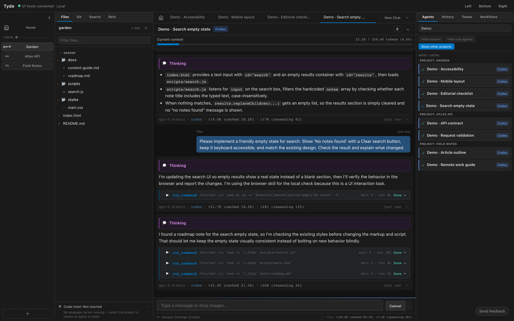
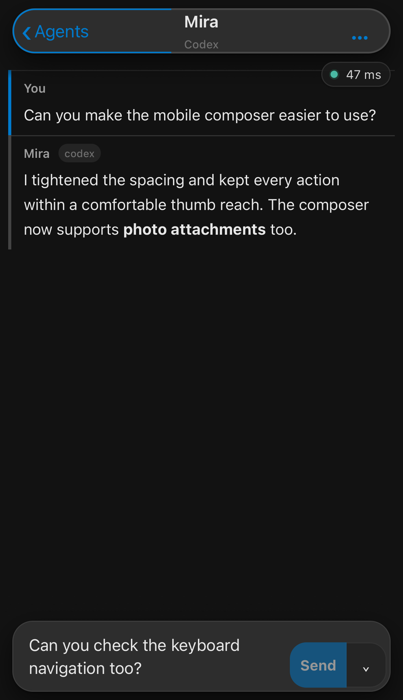

<h1 align="center">Tyde — Agent Studio</h1>

<strong>Manage coding agents across harnesses, projects, and servers.</strong>

<a href="https://tycode.dev/tyde.html">Download Tyde</a> · <a href="docs/book.md">Tyde User Guide</a> · <a href="https://github.com/tigy32/Tyde/releases">Releases</a> · <a href="https://github.com/tigy32/Tyde/issues">Issues</a>

Tyde brings the CLI coding agents you already use—Claude Code, Codex,
Antigravity, Grok, and more—into one desktop application. Run agents
concurrently, organize work across repositories, review their changes, and
coordinate agents using different harnesses. Access those same agents from your
phone to follow their work and reply while you’re away from your computer.

Start an agent locally without creating a project. Add projects when you want
code context. Connect your servers when you want agents to keep working after
your laptop disconnects.

## Your agents. One workspace.

Tyde is a graphical interface over CLI coding harnesses: Claude Code, Codex,
OpenCode, Grok, Antigravity, Hermes, and Kiro. A Claude Code agent in Tyde runs
Claude Code itself; a Codex agent runs Codex. The harness supplies the agent
implementation, models, and native tools, with Tyde providing the interface
for conversations, organization, and review.

If a harness is already installed and signed in on the selected host, use that
existing setup in Tyde. You do not need a separate Tyde API key or a second
model-provider setup for it. If the harness needs installation or authentication,
check **Settings → Backends** for its readiness status and setup controls.
“Backends” is the settings label for these harness integrations.

Agents use the harness’s own authentication and provider account. The provider’s
usage limits and account policies continue to apply.

Give independent tasks their own conversations. Keep agents working across
projects, find the ones that need your attention, and return to earlier work
through session history.

## Close your laptop. Keep work running.

Connect to your home server, work server, or both. Agents run on the selected
host and can continue when the desktop client disconnects. Reconnect to see the
host’s current workspace and pick up where you left off.

Your laptop can be the interface while your servers hold the projects and run
the agents. The remote hosts must remain running for their work to continue.

## The same agents, on your phone.

Open [Tyde mobile](https://tycode.dev/tyde/) to access agents running on your
computer or servers. Read their conversations and tool activity, answer
questions, send follow-ups, stop a turn, or start a new chat on the paired host.
You can also resume saved sessions and enable notifications when an agent
finishes a turn or asks you something.

Tyde mobile is a web app you can add to your Home Screen. The agents and project
files stay on the host; the phone connects to the same work you see on desktop.
Keep that host running and connected while you use mobile.

On desktop, open **Settings → Mobile**, select the host, enable mobile
connections, and choose **Pair via cloud**. Open Tyde mobile on your phone,
scan the pairing QR, and complete the Tyggs Pass sign-in flow. For access through
your own network, Tyde also supports **Pair via local server** with direct
hosting configured.

[Learn how to use Tyde on your phone](docs/book.md#mobile).

## Review the work where it happens.

Open projects with one or more repository roots. Browse files, inspect working
changes, and explore Git commits. Comment on files, diffs, and committed changes,
then submit precise feedback to an agent.

Use workbenches to give independent changes separate Git working trees. Follow
symbols and references with Rust and Python language-server integrations.

## Let different agents work together.

An agent can use Tyde’s tools to create subagents on other available harnesses.
Delegate an investigation, ask for an independent review, or coordinate several
bounded tasks. Follow the parent and its children in the same studio.

Define reusable agents with instructions, skills, MCP servers, and tool policy.
Manage those definitions on each host and reuse them across supported harnesses.
Individual harness capabilities and provider limits still apply.

## Get started

1. [Download and install Tyde](https://tycode.dev/tyde.html).
2. Open **Settings → Backends** on the local host and check your harness’s readiness.
   If it is already installed and signed in, use your existing setup.
3. Start **New Chat**. You do not need a project for your first conversation.
4. Open a project to browse code and review changes, or add a remote host under
   **Settings → Hosts**.

## Read the user guide

Already installed Tyde? The user guide explains the interface and gives step-by-step instructions for its features:

- [Your first agent](docs/book.md#first-agent)
- [Projects and multiple roots](docs/book.md#projects)
- [Code review and Git](docs/book.md#review)
- [Concurrent agents](docs/book.md#concurrency) and [session history](docs/book.md#sessions)
- [Remote hosts](docs/book.md#remote) and [mobile access](docs/book.md#mobile)
- [Cross-harness delegation](docs/book.md#delegation)
- [Custom agents and skills](docs/book.md#agents-skills)
- [Workbenches](docs/book.md#workbenches)
- [Complete workflows](docs/book.md#workflows)
- [Settings](docs/book.md#settings) and [troubleshooting](docs/book.md#troubleshooting)

For the designed reading experience, open `docs/index.html` in a browser or serve
`docs/` with a static server. The links above open the repository edition of the book.
