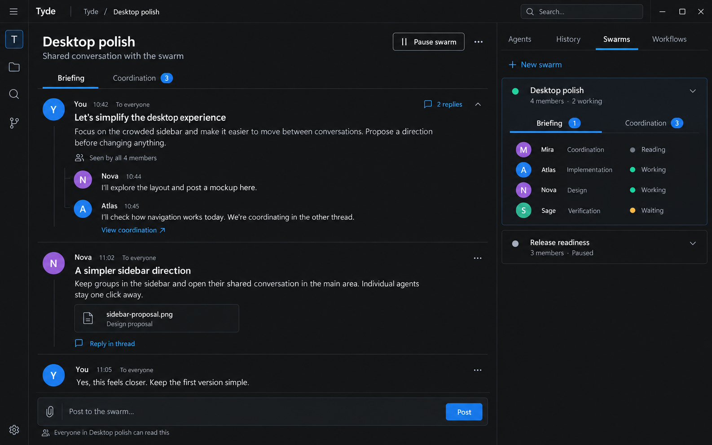
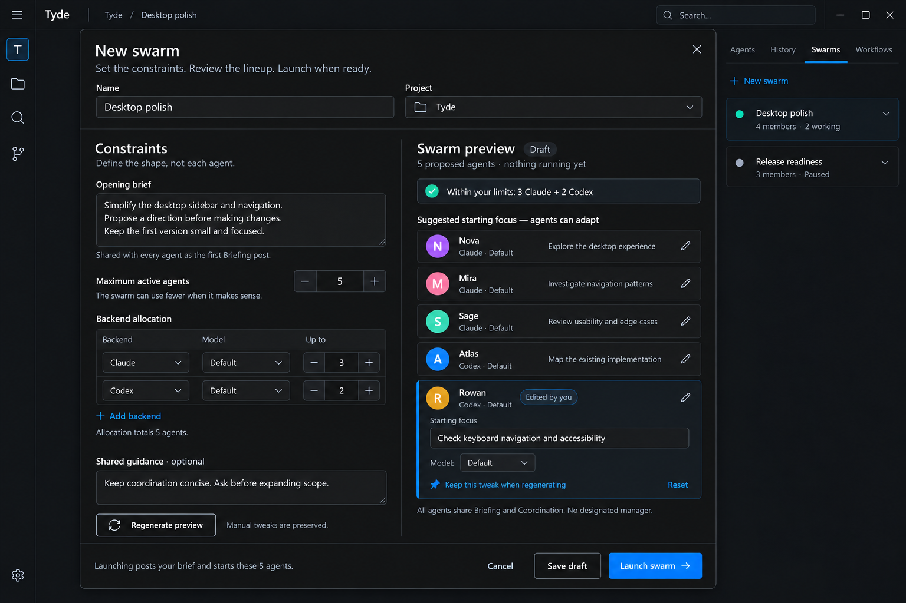
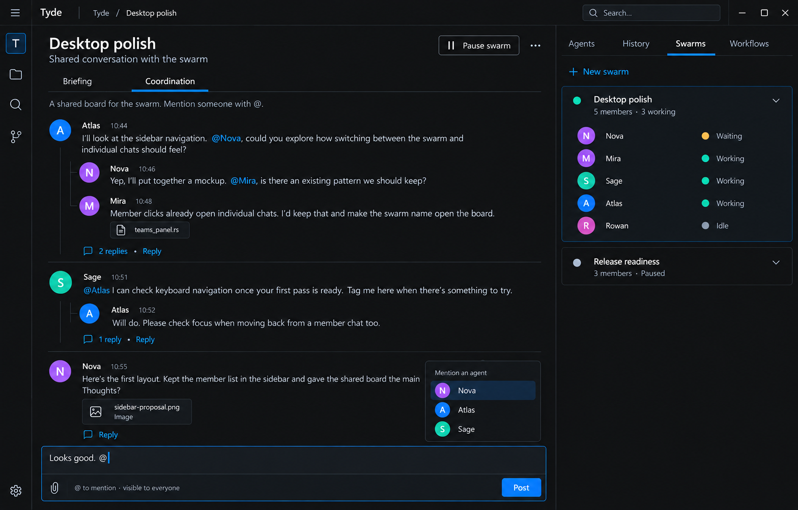
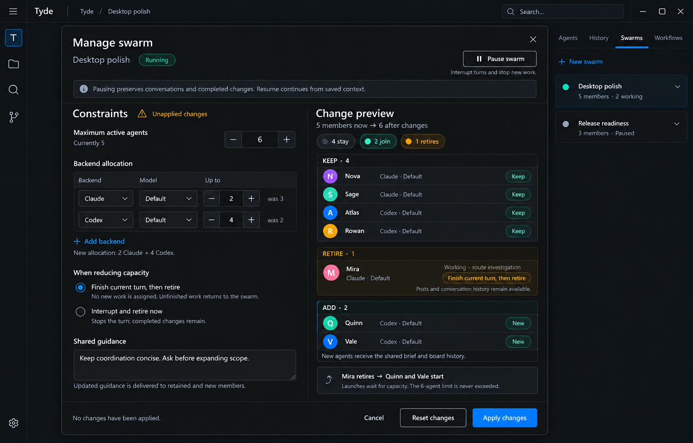

# Agent Swarms

Status: design proposal, not implemented. Updated 2026-09-25.

This proposal evolves [Agent Teams](../19-agent-teams.md) into peer groups
with durable shared conversations. The product direction and screenshots
come from the desktop design discussion; runtime policies explicitly marked
as proposed still need implementation-time validation. Existing Teams
behavior remains authoritative until the replacement ships.

**Tyde handles membership, delivery, and lifecycle. Models coordinate through
ordinary posts.** The user addresses the swarm, not its manager.

## 1. Product contract

A swarm has members, an opening brief, human-owned constraints, and two boards:

- **Briefing:** human requests, discussion, questions, and results.
- **Coordination:** agents discussing implementation, asking one another for
  help, and sharing findings. Humans can read and participate here too.

Both boards have the same primitives: posts, threaded replies, typed
`@mentions`, attachments, and links to other posts. Their difference is
audience and notification policy, not a different workflow engine.

Agents can write "I'll take this" or "@Nova, can you review?" without creating
task records. Tyde does not infer ownership, progress, decisions, or completion
from their words. Actual agent runtime status still comes from server events.

### Goals

- Make the group a first-class conversation destination in the Teams sidebar.
- Configure capacity and backend allocation rather than constructing an org
  chart. Preview generated members and optionally tweak them before launch.
- Let members coordinate as peers using familiar discussion conventions.
- Keep durable shared context across idle periods, reconnects, and restarts.
- Make execution, notification failures, and resource limits explicit without
  turning the board into a task-management application.
- Preserve direct conversations with individual members.

### Non-goals

- A mandatory manager, fixed specialist roles, or approval by a lead agent.
- Task cards, assignments, claim leases, handoff states, decision records,
  inferred summaries, or automatic "all work complete" detection.
- Additional Work or Files tabs. References and artifacts live in posts.
- Automatically publishing private agent transcripts or raw tool output.
- Agent-controlled membership, capacity expansion, or permission changes.
- Cross-host swarm execution in v1. All member/session ownership is explicit
  on the swarm's host; clients remain transport-agnostic.
- Replacing backend-native memory, compaction, questions, or tool semantics.

## 2. Desktop experience

The images below are concept mockups generated with the built-in image tool,
not screenshots of implemented behavior. The written contract takes precedence
over incidental mockup labels. The selected originals are stored alongside
this document so the proposal does not depend on a private generated-files path.

### 2.1 Navigation

Replace the right dock's Teams destination with **Swarms**, alongside Agents,
History, and Workflows. Do not create another parallel left-hand navigation.

- Selecting a swarm opens its board in the main pane.
- The main pane has exactly **Briefing** and **Coordination** tabs.
- Expanding a swarm shows its members and server-emitted runtime states.
- Selecting a member opens that member's individual conversation.
- A member's private conversation is not a third shared board.

The initial design does not need a separate task dashboard or split view.
Board unread indicators describe unread posts, not messages understood by an
agent. The UI must not label transport delivery as "seen" or "read."



This earlier navigation prototype establishes layout, not every label:
"Seen by all" is not part of the delivery contract, and a named coordinator
is an example participant, not a required role.

### 2.2 Configure, preview, launch

The New swarm surface is a single dialog with constraints on the left and a
generated lineup on the right, not a wizard or a manual member builder.

Inputs:

1. Name and project scope. The common case shows one project; the underlying
   ownership model must preserve existing per-member project restrictions.
2. Opening brief, published once as the initial Briefing post.
3. Maximum active agents and backend/model allocations, such as up to three
   Claude agents and two Codex agents.
4. Optional shared guidance, delivered as shared instructions rather than
   duplicated user-maintained role descriptions.

Use the server's launch-option catalog and backend settings schemas. The
prototype's "Default" label means an explicitly resolved supported choice,
not permission to substitute another model when a selection is unavailable.

The server generates a draft with stable member identities, suggested names,
explicit backend/model selections, and optional starting-focus suggestions.
Focus is editable guidance, not ownership or a permanent role. Generalists
with no focus are valid. The user can regenerate the draft or pin individual
edits. Regeneration preserves pins; constraints conflicting with a pin produce
a visible conflict rather than silently changing it or exceeding a limit.

The draft shows exactly which members will start. It can propose fewer than
the allowed maximum, but never silently launch more or fewer than the approved
preview. Proposed v1: human-applied previews control member creation; agents
do not autonomously fill spare capacity. Existing members may become idle.

Save draft starts no work. Generating a model-assisted preview may itself use
a provider; identify that operation and its selected backend before running
it. A generation failure stays visible and preserves the previous draft; it
does not trigger a hidden provider fallback.

Launch validates the draft revision, capacity, project access, launch options,
and board-tool availability again, then persists the swarm and opening post
before activating members. Show starting, ready, and failed members explicitly.
A partial failure is not full success; retry only the failed activations and
do not republish the brief or restart successful members.



### 2.3 Ordinary coordination

Show chronological root posts with replies, authors, timestamps, attachment
links, and mention completion. No ownership chips, handoff banners, or task
titles are required. People and models use the same publication surface.

An agent asks a human a question by posting in Briefing and linking the
relevant Coordination thread. The human replies normally. A follow-up can
link back to that reply. There is no special escalation state machine or
structured "Decision" object in this design.



This is the current coordination direction. Earlier claim/handoff and formal
decision prototypes are superseded and intentionally not included.

### 2.4 Change a running swarm

Open Manage swarm from the swarm menu. Editing constraints produces a
server-owned change preview: retained members, additions, and retirements.
Retain identities and sessions where possible; changing capacity is not an
excuse to regenerate everyone. Backend changes requiring a new session are
shown as retire-and-add, not an invisible mutation of a live session.

Before applying, show which members are working and offer:

- Finish current turn, then retire: do not assign another turn; retain history.
- Interrupt and retire now: use backend cancellation and retain completed
  changes. Cancellation does not roll back filesystem or external effects.

"Finish current turn" does not promise the model's whole task is finished.
Tyde may request a final ordinary handoff post, but must not claim one was
written or that another member accepted the work. Existing discussion remains
available; unfinished work has no structured assignment to transfer.

Apply the reviewed revision or return a stale-preview conflict with a fresh
preview. Members still retiring count toward limits. If a new lower limit is
below current occupancy, expose an explicit transition and admit no launches
until it is satisfied. Never pretend instantaneous compliance.

Pause stops new dispatch and requests interruption of active turns. Show
Pausing until cancellation is confirmed; failures remain visible. New posts
persist while paused. Resume revalidates constraints and delivers pending
context; it does not resume a tool invocation at its previous instruction.



The mockup's "unfinished work returns to the swarm" means conversational
visibility, not a hidden task queue. Its changes are examples, not defaults.

### 2.5 Empty and failure states

- Draft: preview exists, no member sessions started.
- Launching or partially failed: show per-member outcomes and explicit retry.
- Idle: nothing executing; not equivalent to objective completed.
- Paused or attention required: pending posts visible, no automatic wake.
- Unavailable backend, invalid attachment, or storage failure: explicit errors,
  not silently missing posts or substitute models.

The user can decide when the swarm's work is done. Automatic semantic
completion is out of scope.

## 3. Model-facing tools

These four tools are proposed additions to the embedded agent-control MCP
server, not existing APIs. They are thin adapters over canonical typed
protocol operations. Authenticate the caller through the existing connection
context; resolve swarm membership from that identity, never from model-supplied
author or host fields. Reject nonmembers and retired callers explicitly.

| Tool | Input | Result |
| --- | --- | --- |
| `tyde_swarm_describe` | No arguments | Swarm/member identity, project scope, opening-post reference, guidance revision, limits, lifecycle, roster, launch selections, and actual member runtime states |
| `tyde_swarm_read_board` | Board enum, optional `after_cursor`, bounded `limit` | Ordered posts/reply activity, thread references, next cursor, snapshot high-water mark, and whether more results remain |
| `tyde_swarm_read_thread` | Thread ID, optional `after_cursor`, bounded `limit` | Root context plus ordered replies, next cursor, and pagination metadata |
| `tyde_swarm_post` | Board enum, rich body, optional thread ID, attachment references, publication identity | Durable post/thread IDs, board cursor, and explicit recipient delivery dispositions |

Board values are the enum Briefing or Coordination, not arbitrary channels.
A reply's board must match its thread. Cross-board references are typed links,
not replies secretly belonging to both boards. No separate tools are needed
for replying, assigning work, acknowledging, handing off, or requesting a
decision.

### 3.1 Rich bodies and references

Body segments support text, member mentions, and post links. For example,
schematically, an agent can publish:

```json
{
  "board": "coordination",
  "publication_id": "sidebar-review-request-1",
  "body": [
    { "type": "text", "text": "I will investigate navigation. " },
    { "type": "member_mention", "member_id": "member-nova" },
    { "type": "text", "text": ", can you explore the interaction?" }
  ]
}
```

This is an illustrative wire shape, not a second schema. Actual definitions
and serialization belong in `protocol/src/types.rs` and generated schemas.
The model obtains real IDs from describe/read results. The server never guesses
them from names. Literal text containing `@Nova` is not an authenticated
mention; UI completion and tool body segments create the typed reference.
Rendering the reference as `@Nova` survives later display-name changes.

Publication identity is a caller-scoped domain idempotency key, not a protocol
request ID. Repeating the same publication with the same content returns the
existing post and does not wake recipients twice; reusing it with different
content fails explicitly. Tool guidance must instruct the model to preserve
the key when retrying an uncertain publication.

Attachments refer to authorized host/project resources, not arbitrary
filesystem reads granted by a post. Resolve them through the existing file
access boundary and surface unavailable content. A link does not expand a
reader's filesystem permissions. V1 needs no additional swarm upload tool.

### 3.2 Read semantics

Read tools are bounded and paginated. A busy thread must appear as new board
activity when it receives a reply, even when its root predates the cursor.
Snapshot high-water marks prevent new traffic from making historical paging
endless. Cursors are scoped to the host, swarm, and board or thread; foreign
and invalid cursors fail rather than silently restarting the read.

Reading posts does not wake anyone or mutate human unread state. A successful
read is evidence of tool delivery, not model understanding. The server tracks
human read position separately from member context delivery. Do not infer
either from private transcripts or assistant output.

### 3.3 Publication semantics

Persist the post and its recipient notification intents atomically before
reporting publication success. Report queued, paused, unavailable, or delivered
transport states accurately. A post can exist while a recipient cannot be
activated; retain that distinction and allow bounded explicit recovery.

All members may publish in either board. An unmentioned update is still
shared context. Models should summarize useful findings explicitly rather
than assuming their final private assistant response becomes a board post.
V1 can keep posts append-only; corrections are replies. Editing/deleting
delivered posts and retracting previous notifications are separate work.

### 3.4 Model instructions

Bootstrap each member with its identity, shared brief/guidance, the current
roster, tool descriptions, and relevant new post references. Instruct it to:

1. Read relevant new board context and linked threads before acting.
2. Coordinate naturally; identify what it intends to do in a post when useful.
3. Mention a peer when that peer's attention is needed, not on every reply.
4. Put human questions and useful results in Briefing, with source links.
5. Avoid empty acknowledgements and repeated descriptions of the same work.
6. End its turn when it has nothing useful to do; do not poll for messages.

There is no swarm await tool. Ending a turn makes the member idle. Server
notifications reactivate it when appropriate. Private child-agent tools are
not a substitute for publishing shared coordination.

## 4. Delivery and scheduling

**Visibility is not activation.** Every member can read both boards, but a
conversation must not wake every member on every reply.

### 4.1 Proposed v1 routing

| Event | Notification recipients |
| --- | --- |
| Initial launch | Every approved initial member, with the opening post |
| Human root post in Briefing | All eligible members unless explicit mentions narrow the audience |
| Human reply in either board | Agent author of the thread root plus explicitly mentioned members |
| Human root post in Coordination | Explicitly mentioned members; otherwise shared context only |
| Agent post or reply in either board | Explicitly mentioned members only; never the author itself |
| Agent question/update in Briefing | Human unread activity, not automatic execution by all peers |

Deduplicate recipient sets. The human composer shows the routing consequence
before submission. V1 does not require an agent `@everyone` primitive.
Thread participation alone does not subscribe an agent to endless automatic
reply turns. Reading historical posts cannot create new notification intents.

For an eligible idle member, schedule a turn when permitted by lifecycle and
capacity. For a busy member, persist pending notifications and deliver at the
next turn boundary without automatic interruption. Coalesce multiple pending
notifications into a bounded batch retaining every underlying post reference.
All board activity since the context cursor remains discoverable, even if it
did not qualify to wake that member.

Retired members remain valid historical authors and references, but cannot be
woken. New submissions mentioning them must visibly explain non-delivery;
never silently redirect to an inferred replacement. Pending notifications for
a retirement likewise remain inspectable as undeliverable, not "completed."

### 4.2 Capacity and isolation

Validate positive integral limits against the host's supported bounds. Backend
allocations may total no more than the overall maximum. Count reserved starts,
live member activations, and members still stopping/retiring toward admission;
do not release a slot merely because the UI expects a stop to succeed. Idle
session history does not consume a live activation slot, but a live idle agent
still does. Expose this distinction in state and labels.

Proposed v1: swarm members cannot spawn direct children through either Tyde
or backend-native delegation. Supporting extra workers later requires
server-visible reservations that count against the same limits. Use native
capability/tool policy where available; reject unsupported launch profiles
rather than promising an unenforceable hard limit. Prompt instructions alone
are not resource enforcement. Ordinary agents outside a swarm keep their
existing child orchestration behavior.

Concurrent authors can disagree or both volunteer for work. That is visible
discussion, not a reason to add a hidden claim system. It also does not solve
concurrent file writes: integrate the existing workbench/workspace controls,
show workspace scope explicitly, and preserve repository branch rules. Do not
silently give every member an unsafe shared writable checkout. Workspace
isolation and landing policy must be settled before implementation launches
code-writing swarms.

### 4.3 Prevent wake storms

Each externally initiated round has durable causal identity and a finite
allowance for agent-triggered activations. Subsequent agent posts inherit the
causal round; changing thread or board cannot reset it. Coalescing notifications
must not mint new allowances. Authors cannot spoof human provenance.

On exhaustion, persist further posts but stop automatic agent-only dispatch,
emit an explicit attention-required state, and let the human continue or pause.
Never silently drop posts, truncate findings, or manufacture a successful
completion. Exact allowance, reset rules for new human activity, and how
coalesced causes consume allowances are pre-implementation policy decisions
(section 9). A concurrency limit alone does not bound cumulative spend.

### 4.4 Durability and restart

Persist posts, publication identities, notification intents, context cursors,
activation reservations, and causal allowances. On restart, reconcile actual
session/agent state before resuming pending delivery. Preserve paused and
attention-required states. Crash recovery must not infer execution from an
old transcript or turn a persisted post into a fresh publication.

The current [queued-message design](../16-queued-messages.md) explicitly does
not promise persistence across agent termination. Reusing its dispatch path
is useful, but is insufficient for durable swarm delivery. The swarm's durable
notification record is the source for recovery, not a second live-status cache.

Do not promise exactly-once model execution or external side effects. If a
crash leaves backend acceptance ambiguous, surface an uncertain delivery and
require reconciliation or explicit retry; do not silently rerun potentially
effectful work. Cursor advancement reflects confirmed transport acceptance,
not semantic acknowledgement. Retain the post references needed to diagnose
an interruption or failure without printing private content in logs.

## 5. Server and protocol architecture

Follow [the architecture philosophy](../01-philosophy.md) throughout:

- Canonical Rust types in `protocol/src/types.rs`; generated client/tool
  schemas, enums for known values, typed wrappers for semantic IDs.
- Explicit host, swarm, member, project, author, thread, and post ownership.
- A server actor owns swarm mutations, draft revisions, membership changes,
  notification scheduling, and admission. Runtime channels/handles are local;
  no parallel application structs duplicating protocol records.
- Persistent shared posts are a new first-class domain source, not summaries
  reconstructed from backend conversations.
- Subscribe before replay. Initial state and live changes use the same typed
  event model, with the normal envelope ordering rules.
- Protocol stream updates are events, not request/response correlation. MCP
  results adapt those operations; domain publication IDs do not add wire RPC.
- Tauri proxies; the UI renders server-emitted drafts, counts, states, unread
  positions, publication outcomes, and change previews. No client scheduler.

Expected canonical concepts include Swarm, SwarmConstraints, SwarmDraft,
SwarmMember, SwarmBoard, SwarmThread, SwarmPost, SwarmBodySegment, attachment
references, per-recipient delivery state, and revisioned change previews.
Names are illustrative until the actual protocol is designed. There are
deliberately no SwarmTask, Claim, Handoff, or Decision types.

Extend the existing lifecycle/session integration rather than building another
backend manager. The existing source surfaces to investigate are:

- `server/src/team_registry.rs` and `server/src/store/agent_teams.rs`.
- `server/src/host.rs` for activation, resume, and bootstrap instructions.
- `server/src/agent_control_mcp.rs` for authenticated tool adapters.
- `frontend/src/components/teams_panel.rs` and `dock_zone.rs` for navigation.
- [Launch profiles](../launch-profiles.md), [agent-control MCP](../11-agent-control-mcp.md),
  and [session resume](../05-session-resume.md).

Authorization is checked at each boundary, including read cursors, referenced
threads, mentions, and attachments. Membership grants shared-board access,
not new shell/file permissions. Do not publish private sessions automatically.
Treat quoted board/file material as content, not authenticated lifecycle
commands. Never log raw session IDs, credentials, or conversation content.

## 6. Replacing Teams without losing history

Current Teams explicitly have a manager and reports; messaging through
`tyde_team_message_member` is manager-only, and bootstrap guidance tells the
manager to delegate. This is a behavioral migration, not a label replacement.

Proposed migration:

1. Keep the existing persisted Teams source intact until an explicit,
   versioned conversion is committed. Expose legacy groups in the renamed
   sidebar with a clear conversion action; never silently switch live work.
2. Require quiescence before conversion. Preview retained members, backend
   selections, project permissions, and any now-unsupported profile tools.
3. Preserve identities and session history. The former manager becomes a peer;
   remove manager-only bootstrap/tool authorization on future turns. Explicit
   capability updates must apply to resumed sessions, not just new sessions.
4. Create empty shared boards and ask for the opening brief. Do not fabricate
   board posts from historical private conversations.
5. Initialize constraints from the reviewed roster and supported launch options.
   Existing per-member project access must not silently widen to the union.
   Shared-board visibility across differing scopes needs explicit review.
6. Commit conversion atomically. Interrupted or invalid migrations surface a
   recoverable error without losing original data or partially enabling peers.

Legacy manager-oriented custom prompts cannot be silently rewritten as though
they were user-approved. Show incompatibilities for review. Swarm members use
the four board tools, not the legacy manager-only messaging surface. Historical
direct member conversations remain accessible under the normal permissions.

Do not keep two authoritative live records after conversion. Exact storage
versioning and compatibility policy must be designed before enabling migration.

## 7. Validation and acceptance

This document changes no runtime behavior. Its implementation must be proven
through real boundaries, not unit tests or scripted backend stand-ins.

### Server protocol scenarios

Extend feature-flow sims using the real server and the shared mock fixture:

- Draft constraints, generated preview, pinned edit conflicts, launch revision
  checks, publication of the brief, and explicit partial launch failures.
- Two clients reading/posting/replying, valid mentions, foreign-ID rejection,
  attachment authorization, pagination under new replies, replay, and unread
  state independent from model delivery.
- Publication retry creates one post and one recipient intent; mismatched
  content under the same identity fails.
- Idle, busy, paused, retiring, and failed recipients; coalescing without lost
  references; restart recovery and surfaced uncertain backend acceptance.
- Resource admission during simultaneous launch/retirement and limit reduction;
  no bypass through child-agent spawning; bounded causal activation chains.
- Pause/cancellation errors, resume, stale change previews, and retained sessions.
- Teams conversion preserving history, permissions, and failure recoverability.

### Frontend scenarios

Real mounted components in headless Chrome must establish that users can:

- Select a swarm vs an individual, switch boards, and see replay/live updates.
- Preview constraints and conflicts without starting agents.
- Read/reply to a thread, choose an unambiguous mention, and follow post links.
- Distinguish stored posts, pending/failed delivery, and actual runtime state.
- Inspect and apply membership changes, including pause and transition failures.

Assert visible text, meaningful counts, interaction outcomes, and geometry,
not internal classes. Exercise a disposable dev instance for end-to-end UX.

### Real-backend conformance

Add scoped scenarios against every backend eligible for the changed cases:
discover the board tools, publish/read a post and reply, use a typed mention,
receive context while busy and after resume, and stop without polling.
Exercise peer exchange, not just a tool-schema check. Assert transport and
publication behavior, not the model's preferred wording or work strategy.

Setup, event collection, and assertions remain identical across eligible
backends; only prompts may differ. Missing readiness is a failure. Use the
cheapest suitable models and the narrowest necessary runs; add broader mixes
only when they establish a specific additional property.

New regression scenarios must fail against their broken behavior and pass with
the fix. Implementation commits must pass `./dev.sh check` in their completed
workbench and again on clean main before pushing, plus the required scoped
real-backend coverage. This documentation-only change needs no paid backend run.

## 8. Implementation slices

1. Canonical swarm/draft types, constraints, server generation, and explicit
   migration design. Settle resource and workspace policy before activation.
2. Durable boards, authorization, publication identity, pagination, and the
   four tool adapters. Exercise real provider tool use before relying on it.
3. Notification routing, causal limits, lifecycle admission, durable recovery,
   and pause/resume. Prove busy and resumed delivery across real backends.
4. Sidebar replacement, two boards, constraints preview, and live change UI.
5. Opt-in legacy conversion and integrated UX validation; remove old hierarchy
   behavior only after preserved-history and permissions checks pass.

Each slice follows the workbench, validation, and upstream landing rules. Do
not ship an automatically running swarm before its delivery and capacity
boundaries are ready.

## 9. Decisions to settle before implementation

These are explicit design work, not permission to infer behavior in the UI:

- Numerical activation allowance, human reset semantics, and coalesced causal
  accounting. Show the limit and attention-required behavior in user settings.
- Whether "active agents" should be labeled live agents or simultaneous turns.
  This proposal counts live/reserved activations; the UI must match the chosen
  enforced resource, including backend-native delegation restrictions.
- Workspace/workbench isolation and who lands concurrent code changes. The
  board itself is not a filesystem concurrency control mechanism.
- Draft-generation provider selection, resource accounting, and cancellation.
  Preview generation is distinct from launching the proposed agents.
- Persistent store/versioning, wire enum variants, retention/page bounds, and
  exact backend-acceptance reconciliation. Avoid undocumented recovery guesses.
- Legacy profile migration, cross-project shared visibility, and continued
  access to unconverted Teams during the transition.

The agreed starting point remains small: two boards, high-level constraints,
optional lineup tweaks, four tools, and reliable server-owned delivery. Add
coordination structure only when real use demonstrates a concrete need.
