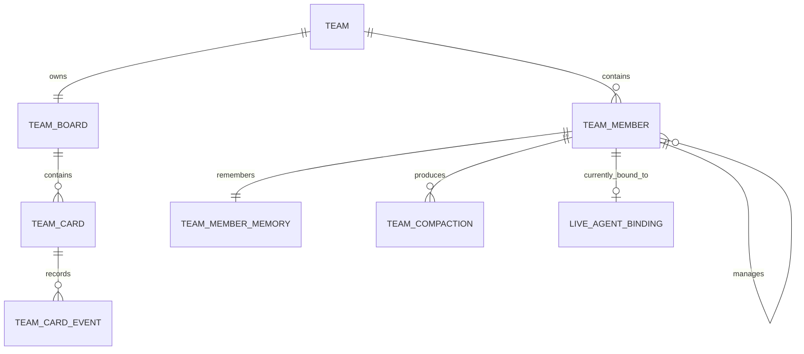

# Codex Review of Claude's Agent Teams Proposal

## Summary of Claude's design (in your words)

- Claude makes a team a server-owned collection of persistent `AgentId`s: one
  manager, N reports, one kanban board, and per-agent memory that survives the
  current backend session.
- Claude chooses SQLite at `~/.tyde/teams.db` for teams/cards/history/memory,
  with a single actor serializing writes and replaying state through protocol
  events.
- Claude treats compaction as Tyde-managed durable memory, not backend-native
  `/compact`: an internal one-shot compactor rewrites `rolling_summary` plus a
  verbatim recent-turn tail, and future backend sessions start from that memory.
- Claude introduces a `Backlog -> Triage -> Assigned -> InProgress -> Review ->
  Done` board lifecycle, with reports able to move only their own cards and the
  manager responsible for assignment/review.
- Claude uses agent-control MCP as a thin callable wrapper over the same server
  mutation path used by UI clicks; the board remains the source of truth.
- Claude splits host-level team listing from per-team detail streams:
  `/host/<uuid>` carries team list events and `/team/<team_id>/<instance_id>`
  carries board/memory detail.

---

## Where Claude is right and you were wrong

1. **Tyde-managed memory should be the v1 compaction primitive.**
   I proposed backend capability modes, including native `/compact` for
   backends that support it. Claude's argument is better: native compaction is
   not observable enough to persist as Tyde memory, so the durable operation
   must be "summarise into Tyde's memory record, then respawn from that summary"
   (`agent-teams-claude.md:330-333`). Their explicit rejection of native
   `/compact` as the durable path is correct (`agent-teams-claude.md:421-436`).

2. **No wall-clock compaction by default.**
   I included an idle 24-hour wall-clock trigger. Claude is right that compacting
   an agent that has not done work is wasteful (`agent-teams-claude.md:353-354`).
   Threshold, task-boundary, and manual compaction are enough for v1.

3. **`Triage` is a clearer board state than my `Claimed`.**
   I used `Claimed` for "manager accepted but has not delegated." Claude's
   split explains the actual workflow better: "manager has read this" and
   "manager has chosen an assignee" are different states
   (`agent-teams-claude.md:477-480`). `Triage` is also a familiar kanban term.

4. **Assignment must be mediated by the team actor, not manager-to-report chat.**
   My design said this, but Claude stated the failure mode more cleanly: a
   queued `SendMessage` to a non-running report is runtime-only and can
   disappear, while a persisted card assignment survives and is redelivered
   (`agent-teams-claude.md:610-620`). That is exactly the right boundary.

5. **Per-team detail streams are probably worth it.**
   I put most team events on the host stream. Claude's split keeps host replay
   light and avoids forcing every frontend to replay every card and memory
   update for every team (`agent-teams-claude.md:790-804`). That better follows
   the event-stream model: subscribe to the detail stream for the thing being
   viewed.

6. **The one-shot internal compactor is an implementable shape.**
   Claude's `MemoryCompactor` as an internal, short-lived agent with one typed
   output tool is concrete enough to implement and test (`agent-teams-claude.md:381-397`).
   My proposal put more burden on each team member to submit its own memory
   update; the internal compactor is cleaner and easier to constrain.

---

## Where you stand by your design

1. **Persistent team identity should be `TeamMemberId`, not `AgentId`.**
   Claude explicitly makes the stable persistent identity an `AgentId`
   (`agent-teams-claude.md:22-29`, `agent-teams-claude.md:115-131`). I still
   think that overloads the current agent model. In `03-agents.md`, `AgentId`
   identifies a live agent stream/session managed by the registry. Team members
   need to survive backend respawn, server restart, parking, memory generation
   changes, and maybe replacement of the live agent process. A separate
   `TeamMemberId` lets the protocol represent that directly without changing
   what a normal agent means. It also avoids stale `AgentId`s after restart:
   the member persists; the live binding is optional runtime state.

2. **Claude's SQL sketch is too stringly typed as written.**
   Their schema stores `role`, `state`, `created_by`, and `actor` as ad hoc
   `TEXT` values (`agent-teams-claude.md:171-201`) and only later introduces a
   typed `CardActor` (`agent-teams-claude.md:660-669`). Storage bytes are allowed
   to be bytes, but the store boundary must deserialize into protocol enums and
   fail loudly. No server code should branch on raw SQL strings.

3. **Card errors should be `CommandError`, not `AgentError`.**
   Claude says invalid moves/races should emit non-fatal `AgentError`
   (`agent-teams-claude.md:498-500`, `agent-teams-claude.md:983-989`). That is
   wrong for human/UI board commands: the failed operation is a command on a
   team stream, not an agent failure. Use `CommandErrorPayload` with
   `CommandErrorCode::InvalidInput`, `Conflict`, or `NotFound` on the affected
   stream. MCP callers can receive the same typed error through the tool result.

4. **Board/card protocol should be more normalized than Claude's nested `Card`.**
   Claude's `Card` embeds comments and history (`agent-teams-claude.md:699-713`).
   That makes every card movement potentially replay a growing activity log.
   I still prefer current-card snapshots plus append-only activity events:
   render board state from snapshots; render history from events. This follows
   the queued-message snapshot precedent while avoiding giant same-key card
   payloads.

5. **Delete/disband semantics need full records and consistency.**
   Claude's doc says disband deletes the board in non-goals
   (`agent-teams-claude.md:62`) but later says disband soft-deletes and cards
   become read-only (`agent-teams-claude.md:991-996`). The soft-archive version
   is better, but the proposal contradicts itself. Also `BoardNotify::CardDelete`
   carries only an ID (`agent-teams-claude.md:520-523`,
   `agent-teams-claude.md:776-781`), unlike the project precedent where delete
   carries the full deleted record. I stand by full-record delete events.

6. **The current repo does not have the existing SQLite precedent Claude cites.**
   Claude says `teams.db` should use the same WAL pattern as an existing
   `session.db` (`agent-teams-claude.md:158-159`). In this repo, sessions are
   JSON-backed (`server/src/store/session.rs` uses `~/.tyde/sessions.json`).
   SQLite may still be the right choice, but it is a new persistence dependency,
   not an existing pattern.

---

## Genuine remaining disagreements

1. **Persistent identity: `AgentId` vs `TeamMemberId`.**
   - Claude: team members are persistent `AgentId`s.
   - Codex: team members are stable `TeamMemberId`s with optional live
     `AgentId` bindings.
   - Tradeoff: `AgentId` is simpler to explain but changes the meaning of an
     existing live-session identity. `TeamMemberId` adds a type but keeps
     lifetimes explicit.
   - Recommendation: `TeamMemberId`.

2. **Persistence backend: JSON file vs SQLite database.**
   - Claude: SQLite for append-heavy cards/history/memory.
   - Codex original: JSON store matching current host-owned domains.
   - Tradeoff: JSON better matches existing stores and serializes protocol
     structs directly; SQLite gives transactional append/update and avoids
     rewriting large histories.
   - Recommendation: SQLite, but only with a single `TeamStoreActor`, strict
     enum deserialization, and an explicit acknowledgement that this is a new
     dependency/pattern.

3. **Stream shape: all host stream vs per-team detail stream.**
   - Claude: host stream lists teams; `/team/...` streams board/memory detail.
   - Codex original: host stream carries all team state.
   - Tradeoff: host-only is simpler; per-team avoids replaying every card for
     every team and scales better.
   - Recommendation: per-team detail streams with an explicit `TeamSubscribe`
     input, modeled after existing stream allocation patterns.

4. **Team agent resume: backend session resume vs memory-only respawn.**
   - Claude: team agents do not use normal session-resume; memory is their
     resume mechanism (`agent-teams-claude.md:450-453`).
   - Codex original: store `last_session_id` and possibly resume.
   - Tradeoff: backend resume preserves raw context but can defeat compaction;
     memory-only respawn is predictable but may lose backend-native continuity.
   - Recommendation: memory-only respawn for v1; keep old sessions for audit,
     not for team-member continuity.

5. **Who accepts `Done`: manager vs human.**
   - Both proposals let managers move `Review -> Done`; humans override.
   - Tradeoff: manager acceptance preserves autonomy; human acceptance gives
     stronger product/quality control.
   - Recommendation: manager can mark `Done` in v1. Humans can reopen/cancel,
     and history makes the decision auditable.

Remaining Mike calls: **5**.

---

## Proposed unified design

This is the merged plan I would actually advocate for as the final
`dev-docs/<n>-agent-teams.md`.

### 1. Goals and non-goals

Goals:

- Persistent team members that remember prior work across backend sessions.
- A flat org chart: one manager, N direct reports.
- A server-owned kanban board where humans add work and managers delegate.
- Server-owned memory, compaction, board state, task history, and manager wake
  behavior.
- Agent-control MCP tools for managers/reports that route into the same server
  mutation path as UI events.
- Local and remote hosts behave identically; the frontend renders protocol
  events only.

Non-goals:

- Nested teams, multiple managers, cross-team membership, and matrix orgs.
- Agent-created or agent-mutated org charts.
- Backend-native sub-agents as team members.
- Native backend `/compact` integration in v1.
- Budget/cost accounting in v1.
- Custom board columns in v1.

### 2. Conceptual model

Definitions:

- **Team**: host-owned organization with one manager, zero or more reports, and
  one board.
- **TeamMember**: durable member identity (`TeamMemberId`) with role, backend /
  custom-agent configuration, and memory. It may currently be bound to a live
  `AgentId`, or not.
- **Manager**: `TeamMemberRole::Manager`; wakes on board/report events and
  delegates/reviews work.
- **Report**: `TeamMemberRole::Report`; accepts assigned cards and moves only
  its own work through allowed states.
- **Memory**: rolling summary plus recent turn tail attached to `TeamMemberId`.
- **Board**: one kanban board per team.
- **Column**: fixed enum lane.
- **Card**: durable work item with snapshot state and append-only activity.



The existing live agent model remains intact. Team agents are normal live agents
with `AgentOrigin::TeamMember` while running, but the persistent identity is the
team member.

### 3. Persistence model

Use one SQLite database at:

```text
~/.tyde/teams.db
```

This is a new store pattern for Tyde2, justified by card history and memory
turns being append-heavy. Rules:

- A single `TeamStoreActor` owns the SQLite connection and serializes all
  writes. No `Arc<Mutex<Connection>>`.
- No read-only side connections in v1. If reads become expensive, benchmark
  first.
- SQL rows are persistence only. The store actor deserializes into protocol
  enums/structs and fails loudly on invalid data.
- Mutations commit durable state and activity history in one transaction before
  fanout.
- No frontend or Tauri code touches SQLite.

Sketch tables:

```sql
teams(team_id, name, project_id, created_at_ms, archived_at_ms)
team_members(member_id, team_id, role, state, name, description,
             manager_member_id, backend_kind, custom_agent_id,
             project_id, workspace_roots_json, created_at_ms, updated_at_ms)
team_boards(board_id, team_id, name, created_at_ms, updated_at_ms, archived_at_ms)
team_cards(card_id, board_id, title, body, column, position, version,
           manager_member_id, report_member_id, created_at_ms, updated_at_ms)
team_card_events(event_id, card_id, created_at_ms, actor_json, event_json)
team_member_memory(member_id, generation, updated_at_ms, summary_markdown,
                   open_commitments_json, source_compaction_id)
team_memory_turns(member_id, turn_index, agent_id, seq_start, seq_end,
                  summary, verbatim_excerpt)
team_compactions(compaction_id, member_id, trigger, status, started_at_ms,
                 completed_at_ms, previous_generation, next_generation, error)
```

Runtime-only live binding is not persisted as durable identity. After restart,
all bindings replay as `None` until the coordinator wakes members and spawns new
live agents.

### 4. Org structure

V1 org invariants:

- each team has exactly one active manager
- each report has exactly one manager: the team's manager
- a member belongs to one team
- no nested teams
- managers can delegate only to direct reports in the same team
- archiving a member with non-terminal assigned cards is rejected until those
  cards are reassigned, blocked, canceled, or done

Manager replacement is human-only in v1 and happens through one typed server
mutation. The old manager becomes a report or is archived, but the operation is
atomic.

### 5. Memory and compaction strategy

Compaction means updating Tyde-owned memory. It does not mean invoking backend
native `/compact` in v1.

Triggers, checked only when the member is idle:

- context threshold after `TypingStatusChanged(false)`: most recent
  `ContextBreakdown.input_tokens >= 70%` of `context_window`
- card boundary: assigned card moved to `Done`, `Blocked`, or `Canceled`
- manual compact-now from human, manager, or self

No wall-clock compaction by default.

Memory preserves:

- role/custom-agent/steering/skill/MCP resolution, reconstructed at spawn
- current team/member/card IDs and active card snapshot
- rolling summary markdown
- typed open commitments
- last N recent turns, with bounded verbatim tail
- durable card history as external anchor

Implementation:

- `MemoryCompactor` is an internal one-shot agent, not a team member.
- It receives previous memory, recent turns, and card-event manifest.
- It must call one typed tool, `submit_compaction`, with the new memory fields.
- On success, the store transaction writes memory generation, recent-turn tail,
  and `TeamCompactionNotify { Completed }`.
- On failure, old memory remains active and `TeamCompactionNotify { Failed }`
  is emitted.

Team members do not resume old backend sessions as their continuity mechanism.
When a live binding is missing or too stale relative to memory generation, Tyde
spawns a fresh backend session with role + memory + active-card context.

### 6. Task lifecycle

Columns:

```rust
pub enum TeamCardColumnKind {
    Backlog,
    Triage,
    Assigned,
    InProgress,
    Blocked,
    Review,
    Done,
    Canceled,
}
```

Allowed core transitions:

```text
Backlog    -> Triage       manager claims/triages
Triage     -> Assigned     manager assigns report
Triage     -> Canceled     manager/human rejects
Assigned   -> InProgress   assigned report starts
InProgress -> Review       assigned report submits
InProgress -> Blocked      assigned report is blocked
Review     -> Done         manager accepts
Review     -> InProgress   manager requests rework
Blocked    -> InProgress   manager/report unblocks
Blocked    -> Canceled     manager/human cancels
Any non-terminal -> Canceled by human
```

Humans can override any move. Managers can triage, assign, review, unblock, and
cancel. Reports can move only their own assigned cards through start/block/review.
The server validates every move and emits `CommandError` on invalid input or
version conflict.

Each accepted mutation emits:

- `TeamCardNotify::Upsert { card }` with the full current snapshot
- `TeamCardActivityNotify { event }` with the append-only activity event

The board is rendered from card snapshots, not reconstructed from history.

### 7. Manager loop

A `TeamCoordinator` actor owns the manager loop. Managers do not poll.

Wake triggers:

- new card in `Backlog`
- card stuck in `Triage`
- report moves card to `Review`
- report moves card to `Blocked`
- report fails/closes while assigned
- server restart with non-terminal cards
- manual "ask manager" action

The coordinator coalesces wake reasons: at most one pending manager wake while
the manager is busy. Delivery uses existing queued-message behavior, but the
source of truth is the card, not the queued prompt.

Assignment flow:

1. manager reads board/card through MCP
2. manager calls `tyde_team_assign_card`
3. server validates caller, card version, team membership, and report state
4. server moves card to `Assigned` and appends `ReportAssigned`
5. server wakes/spawns the report with card prompt
6. report starts or queues the work prompt through the normal agent actor

### 8. Protocol changes

Add typed IDs:

```rust
pub struct TeamId(pub String);
pub struct TeamMemberId(pub String);
pub struct TeamBoardId(pub String);
pub struct TeamCardId(pub String);
pub struct TeamCardEventId(pub String);
pub struct TeamCompactionId(pub String);
```

Add enums:

```rust
pub enum AgentOrigin { User, AgentControl, BackendNative, TeamMember }
pub enum TeamMemberRole { Manager, Report }
pub enum TeamMemberState { Active, Paused, Archived }
pub enum TeamCardColumnKind { Backlog, Triage, Assigned, InProgress, Blocked, Review, Done, Canceled }
pub enum TeamCardActor { Human, Member { member_id: TeamMemberId }, Server }
pub enum TeamCompactionTrigger { TokenThreshold, CardBoundary, Manual, RestartRecovery }
pub enum TeamCompactionStatus { Started, Completed, Failed }
```

Extend `AgentStartPayload` and `NewAgentPayload`:

```rust
pub team_id: Option<TeamId>,
pub team_member_id: Option<TeamMemberId>,
```

Validation: `AgentOrigin::TeamMember` requires both fields; non-team origins
require both to be `None`.

Add records: `Team`, `TeamSummary`, `TeamMember`, `TeamBoard`, `TeamCard`,
`TeamCardEvent`, `TeamMemberMemory`, `TeamCompactionRecord`, and
`TeamMemberBindingPayload`.

Streams:

- `/host/<uuid>`: team CRUD, team summaries, and team stream subscription.
- `/team/<team_id>/<instance_id>`: board/member/card/memory detail for one
  subscriber.

Input frame kinds:

```rust
TeamCreate
TeamRename
TeamArchive
TeamMemberCreate
TeamMemberUpdate
TeamMemberArchive
TeamSubscribe
TeamClose
TeamBoardRename
TeamCardCreate
TeamCardUpdate
TeamCardMove
TeamCardAssignReport
TeamCardAddNote
TeamCardArchive
TeamMemberCompactNow
```

Output frame kinds:

```rust
TeamNotify              // host stream: upsert/delete summary
TeamStart               // seq 0 on team stream
TeamMemberNotify
TeamMemberBindingNotify
TeamBoardNotify
TeamCardNotify
TeamCardActivityNotify
TeamMemoryNotify
TeamCompactionNotify
```

Replay order:

1. host settings/schemas/backend setup
2. projects
3. MCP/skills/steering/custom agents
4. team summaries
5. live agents
6. per selected team stream: `TeamStart`, members, board, cards, activity,
   memory, compactions, live bindings

Card mutation payloads include `expected_version`. Stale mutations fail with
`CommandErrorCode::Conflict`.

### 9. MCP surface

Add team tools to the existing embedded agent-control MCP. They are thin shims
over the same `TeamCoordinator` commands as UI actions.

Tools:

- `tyde_team_list`
- `tyde_team_describe`
- `tyde_team_read_board`
- `tyde_team_read_card`
- `tyde_team_move_card`
- `tyde_team_assign_card`
- `tyde_team_comment_card`
- `tyde_team_compact_member`

No MCP tools for team creation, member creation, or manager replacement in v1.
Org changes are human-only.

Authorization comes from the injected MCP caller context. The caller does not
supply its own identity. Reports cannot assign cards. Managers cannot assign to
non-reports or cross-team members.

### 10. Frontend surface

- Teams panel: team list, manager, report count, open-card count, archived badge.
- Board view: fixed columns, keyed cards, server-driven drag/move commands.
- Card detail: body, current manager/report, notes, activity, links to live agent
  streams.
- Member cards: role, backend/custom-agent, live binding/status, memory preview,
  memory generation, compaction status.
- Full memory is loaded from the team stream or an explicit typed read; the
  summary preview is enough for the board.

The frontend owns only transient UI state such as selected team/card and panel
open/closed state.

### 11. Failure modes

- **Manager crashes mid-triage**: card remains in `Triage`; coordinator rewakes
  on restart or stuck-triage timeout. If no manager can be spawned, team health
  is visibly blocked and human must replace/repair the manager.
- **Report fails mid-card**: coordinator moves card to `Blocked` with a server
  activity event and wakes manager.
- **Compaction fails**: old memory generation remains active; emit failed
  compaction record; do not partially update summary.
- **Compaction loses context**: recent-turn tail and durable card history remain;
  memory generation identifies when loss happened.
- **Racy card moves**: actor serializes commands; stale `expected_version`
  returns `CommandErrorCode::Conflict`.
- **Server restart**: live bindings reset to `None`; coordinator respawns
  manager/reports for non-terminal work using memory injection.
- **Disband/archive team**: team is archived, cards become read-only, live agents
  are not automatically killed. Hard delete can be a later cleanup feature.
- **MCP disabled**: autonomous team loops pause visibly; human board operations
  still work.

### 12. Open questions

- Does Mike approve SQLite as the first non-JSON host store, given it is a new
  dependency/pattern in this repo?
- Should team members ever resume old backend sessions for audit/continuity, or
  always spawn fresh from memory?
- Should there be a host/team concurrency cap in v1 to avoid autonomous cost
  surprises?
- Should reports be allowed to spawn transient sub-agents while working cards,
  and if yes should those helpers appear anywhere on the board?
- Should full memory be user-editable in v1, or only visible with manual
  compaction?
