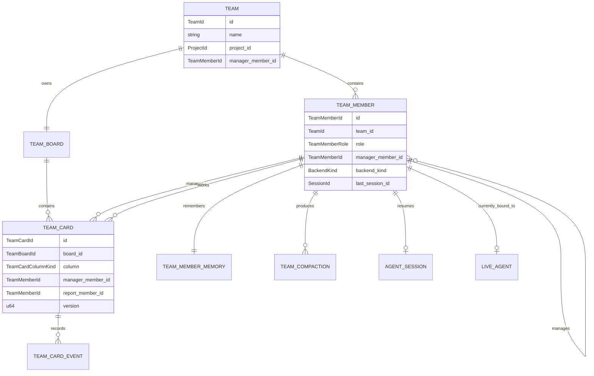

# Agent Teams Proposal (Codex)

## Position

Agent Teams should be a server-owned orchestration domain layered on top of the
existing agent registry, not a frontend board bolted onto chat. The durable
identity is a **team member**, not a live backend subprocess. A team member can
be represented by different live `AgentId`s over time as Tyde resumes, compacts,
parks, or restarts the backing session, but the org chart, assigned cards, and
memory remain attached to the stable `TeamMemberId`.

The v1 shape should be intentionally narrow:

- one board per team
- one manager per team
- reports belong to exactly one manager inside that team
- no nested teams
- fixed kanban columns
- server-owned manager loop triggered by board and agent events
- MCP tools for agents as a command surface only; the kanban itself is a
  first-class server/protocol entity

That gives Mike the team/manager/delegation/memory workflow without making the
UI infer behavior or making agents invent their own task store.

---

## 1. Goals and non-goals

### Goals

- Give agents a durable team identity that survives individual task assignment,
  backend session restarts, app restarts, and compaction.
- Model a simple org structure: a team has one manager and multiple direct
  reports.
- Provide a server-owned kanban board where humans create/reorder work and
  managers claim/delegate cards.
- Keep board state, team membership, task history, and memory on the server with
  typed replay/live events.
- Let manager agents interact with the board through the agent-control MCP
  without making MCP the source of truth.
- Preserve useful long-lived context through a server-owned memory record and
  explicit compaction events.
- Keep local and remote hosts identical from the frontend's perspective.

### Non-goals

- No nested teams or matrix management in v1.
- No custom/user-defined kanban columns in v1.
- No frontend-side board logic beyond rendering server events and sending typed
  commands.
- No autonomous creation of teams or org charts by agents in v1; humans create
  and edit teams.
- No attempt to make backend-native sub-agents into team reports. Team reports
  are Tyde-owned persistent members. Backend-native children remain the
  separate `BackendNative` origin from `15-sub-agents.md`.
- No hidden child-output injection into manager chats. Managers read report
  output explicitly through MCP tools or receive server-authored wake prompts.
- No cloud sync or remote push semantics. A remote host owns its own team store
  exactly like it owns projects and sessions.

---

## 2. Conceptual model

### Definitions

**Team**
: A host-owned persistent organization unit. A team has a name, optional
  `project_id`, one manager member, zero or more report members, and exactly one
  board in v1.

**Team member**
: The durable identity of an agent inside a team. It has a stable
  `TeamMemberId`, role, backend/custom-agent configuration, optional last
  backend `SessionId`, and memory. It may or may not currently have a live
  `AgentId`.

**Manager**
: A team member with `TeamMemberRole::Manager`. The manager watches the team's
  board through server wake prompts, claims backlog cards, chooses reports, and
  reviews reported work. There is exactly one active manager per team in v1.

**Report**
: A team member with `TeamMemberRole::Report`. A report can receive delegated
  cards from the manager, update card status, add notes, and request review.
  Reports cannot assign work to other members in v1.

**Memory**
: A server-owned structured/markdown rolling summary attached to a
  `TeamMemberId`. It is independent of the current live `AgentId`. It is
  updated by compaction and injected into future team-member wakes/spawns.

**Board**
: The team's kanban board. V1 creates one board per team automatically and does
  not allow additional boards.

**Column**
: A fixed enum lane on the board, not a user-defined string. Columns are:
  `Backlog`, `Claimed`, `Assigned`, `InProgress`, `Blocked`, `Review`, `Done`,
  and `Canceled`.

**Card**
: A durable work item on the board. A card has current column, title/body,
  position, assigned manager/report fields, version, and an append-only typed
  activity history.

### ER-style diagram



`LIVE_AGENT` above is not a new persistent protocol type. It is the existing
live `AgentId`/agent actor model. The durable association is from
`TeamMemberId` to `last_session_id` plus memory; the current `AgentId` is a
runtime binding that can change.

---

## 3. Persistence model

### Choice: one JSON store for v1

Use one host-local JSON store:

```text
~/.tyde/agent_teams.json
```

This matches the existing project/custom-agent/settings/session-store style:
full-file validation, typed Rust structs, atomic replacement, and loud failure
on invalid persisted state. Agent Teams does not need arbitrary relational
queries in v1, and a single file avoids cross-file transactions when a card
snapshot and its activity event must update together.

I would not introduce SQLite in v1. The moment we have thousands of cards or
large audit histories, SQLite may become justified. Until then, JSON keeps the
implementation consistent with the rest of Tyde2 and avoids a second persistence
stack. If JSON performance is measured and becomes a problem, the protocol can
stay unchanged while the server store is replaced.

### Store ownership

A `TeamStore`/`TeamCoordinator` actor in `tyde-server` owns this state. It loads
the JSON file at host startup, validates all invariants, processes mutations
serially, writes accepted mutations atomically, and only then fans out protocol
events. The frontend never reads this file and never derives board semantics.

### Sketch schema

These structs should live in `protocol/src/types.rs` when they cross the wire.
The store file should serialize those same protocol structs where possible;
store-only wrapper maps are acceptable because they are persistence containers,
not parallel domain models.

```rust
#[derive(Debug, Clone, Serialize, Deserialize)]
pub struct AgentTeamsStoreFile {
    pub version: u32,
    pub teams: HashMap<String, Team>,
    pub members: HashMap<String, TeamMember>,
    pub boards: HashMap<String, TeamBoard>,
    pub cards: HashMap<String, TeamCard>,
    pub card_events: HashMap<String, Vec<TeamCardEvent>>,
    pub memories: HashMap<String, TeamMemberMemory>,
    pub compactions: HashMap<String, TeamCompactionRecord>,
}
```

Where each domain stores:

- **team membership/org**: `teams`, `members`
- **board state**: `boards`, `cards`
- **task history**: `card_events`
- **per-agent memory**: `memories`, `compactions`
- **persistent live-agent continuity**: `TeamMember.last_session_id`, not a
  durable `AgentId`
- **current live-agent binding**: runtime-only server state emitted through
  `TeamMemberBindingNotify`, never persisted as durable identity

Important validation rules on load and mutation:

- every member references an existing team
- each team has exactly one active manager
- every report references that team's manager
- no report has multiple managers
- no member manages itself
- each board references an existing team
- v1 rejects more than one non-archived board per team
- every card references an existing board
- card manager/report fields reference members from the same team
- card column/assignment invariants are enforced (for example `Assigned` must
  have both a manager and a report)
- memory and compaction records reference existing members

No repair-on-load. If persisted state is invalid, the host startup should fail
that store loudly instead of silently dropping records.

---

## 4. Org structure

V1 should intentionally model the simplest org structure that satisfies the ask:

- a team has exactly one active manager
- reports belong to that manager
- a report cannot have multiple managers
- a manager cannot also be a report in the same team
- teams do not nest
- cards cannot be delegated across teams

This is restrictive, but it makes invalid states unrepresentable and avoids the
hard parts of matrix orgs: priority conflicts, cyclic delegation, and ambiguous
manager wakeups.

A future version can add nested teams by changing `TeamMemberRole` or adding a
`parent_team_id`, but v1 should not pay that complexity tax.

---

## 5. Persistent member lifecycle

A persistent team member is not the same thing as an always-running subprocess.
The durable identity is:

```text
TeamMemberId + TeamMemberMemory + last_session_id + team/org config
```

A live `AgentId` is a runtime binding. The server may create a new live agent
for the same member when:

- the member is first woken
- the previous live agent failed
- the server restarted
- compaction used a restart-from-memory strategy
- the report is assigned a new card after being parked idle

When a team member is spawned as a live agent, the normal agent protocol still
applies. The live agent should be announced as a normal agent, with explicit team
metadata added to the birth certificate:

```rust
pub struct AgentStartPayload {
    // existing fields...
    pub origin: AgentOrigin,
    pub team_member_id: Option<TeamMemberId>,
    pub team_id: Option<TeamId>,
}
```

I would add a new `AgentOrigin::TeamMember` rather than overloading
`AgentOrigin::AgentControl`. A team member is server-orchestrated, but it is not
an ephemeral helper spawned by an arbitrary parent agent. The frontend should be
able to render that distinction without inference.

---

## 6. Memory and compaction strategy

### What compaction means

Compaction has two separate outcomes:

1. **Update server-owned team memory** for the `TeamMemberId`.
2. **Reduce live backend context** if the backend supports a real compact path
   or if Tyde uses a restart-from-memory strategy.

The server memory is the canonical cross-restart memory. Native backend
compaction is an optimization for the current live session, not the source of
truth.

### Trigger policy

The `TeamMemberSupervisor` actor tracks compaction eligibility. It triggers
compaction only when the member is idle or at a safe task boundary, except for a
hard context-pressure stop.

Triggers:

- **Token/context threshold**: after a backend reports
  `ContextBreakdown.input_tokens >= 70%` of `context_window`, or after reported
  `conversation_history_bytes` crosses a configured threshold. If no token data
  exists, use a conservative turn-count threshold such as 24 completed turns
  since last compaction.
- **Task boundary**: when a card moves to `Review`, `Done`, `Canceled`, or
  `Blocked` after meaningful work.
- **Wall-clock idle**: at most once every 24 hours while the member is idle, and
  only if new turns/card activity happened since the previous compaction.
- **Manual**: human-issued `TeamMemberCompactNow` command.

There is one compaction in flight per member. Additional triggers coalesce into
one pending reason; they do not spawn parallel compactions.

### What is preserved vs summarized

Preserved exactly/reconstructed, not summarized:

- system prompt materialized by Tyde
- team role instructions
- selected backend/custom-agent/settings IDs
- skills/MCP/steering resolution
- current team/org IDs and manager/report relationship
- current active card snapshot and its typed activity history
- recent N complete turns, bounded by count and bytes, when available

Stored as rolling memory:

- durable project conventions learned by the member
- important decisions and why they were made
- completed-card summaries
- open commitments and follow-ups
- known failures/blockers
- manager/report collaboration preferences
- facts explicitly marked by the user or manager as worth remembering

Dropped or aggressively summarized:

- raw stream deltas
- transient tool output not referenced by a card, decision, or open commitment
- stale plans for completed/canceled cards
- duplicate reasoning text

Suggested memory type:

```rust
#[derive(Debug, Clone, PartialEq, Eq, Serialize, Deserialize)]
pub struct TeamMemberMemory {
    pub member_id: TeamMemberId,
    pub generation: u64,
    pub updated_at_ms: u64,
    pub summary_markdown: String,
    pub open_commitments: Vec<TeamMemoryCommitment>,
    pub recent_turns: Vec<TeamRecentTurn>,
    pub active_card_ids: Vec<TeamCardId>,
    pub source_compaction_id: Option<TeamCompactionId>,
}
```

`summary_markdown` is human-readable because users will inspect and edit memory
later. The list fields are typed because the server needs to reason about open
commitments and active cards.

### How the memory update is produced

Do not scrape arbitrary assistant prose and pretend it is memory. The server
should ask the member to compact and require a typed MCP call such as
`tyde_submit_team_memory_update`. The request context identifies the caller;
the agent does not get to choose another `member_id`.

If the member does not submit a valid memory update, the compaction fails
visibly and the previous memory generation remains current. There is no partial
replacement.

### Where memory lives across restarts

Memory lives in `~/.tyde/agent_teams.json` under `memories` and
`compactions`. On server restart, team members have no live `AgentId`, but their
`TeamMemberMemory` and `last_session_id` are loaded before any manager wake.
When the server starts or resumes a team member, it materializes memory into the
team-member context along with the current card snapshot.

### Backend-specific compaction

Add an explicit backend capability instead of trying one strategy and silently
falling back to another:

```rust
#[derive(Debug, Clone, Copy, PartialEq, Eq, Serialize, Deserialize)]
#[serde(rename_all = "snake_case")]
pub enum TeamCompactionMode {
    NativeCompact,
    RestartFromMemory,
    MemoryOnly,
}
```

Recommended v1 mapping:

| Backend | V1 mode | Notes |
|---|---|---|
| Claude | `NativeCompact` once the wrapper proves it can drive Claude Code's `/compact` over the existing subprocess protocol | Still store Tyde memory first. If native compact fails, emit `CompactionFailed`; do not silently restart. |
| Codex | `RestartFromMemory` until the Codex backend exposes and tests a typed compact operation | Do not assume `/compact` support just because another backend has it. |
| Tycode | `RestartFromMemory` | Use Tyde memory plus current card context when spawning the next live agent. |
| Kiro | `MemoryOnly` or `RestartFromMemory`, depending on ACP session semantics | If restart loses too much session state, mark as `MemoryOnly` and surface context pressure instead of pretending compaction happened. |
| Gemini | `RestartFromMemory` | No native compact assumed. |

`MemoryOnly` means Tyde can preserve long-lived memory but cannot reduce the
current live backend context. If a memory-only member hits hard context pressure,
the server should block new delegation to that member and surface a typed
compaction error until the user chooses to restart/park it.

For `RestartFromMemory`, the live backend session can be closed after a
successful memory update at a safe boundary. The next wake starts a new live
agent with the same `TeamMemberId`, the stored memory, and the active-card
context. That changes `AgentId` and possibly `SessionId`; it does not change the
persistent team member.

---

## 7. Task lifecycle

### Columns

```rust
#[derive(Debug, Clone, Copy, PartialEq, Eq, Serialize, Deserialize)]
#[serde(rename_all = "snake_case")]
pub enum TeamCardColumnKind {
    Backlog,
    Claimed,
    Assigned,
    InProgress,
    Blocked,
    Review,
    Done,
    Canceled,
}
```

Lifecycle:

```text
Backlog -> Claimed -> Assigned -> InProgress -> Review -> Done
                       |             |          |
                       v             v          v
                    Blocked <----- Blocked    Assigned (rework)

Any non-terminal column -> Canceled by a human or manager
```

Meaning:

- `Backlog`: unclaimed work created by a human or explicit protocol command.
- `Claimed`: the manager accepted responsibility but has not delegated yet.
- `Assigned`: a report has been selected and prompted, but has not started.
- `InProgress`: the report has accepted/started work.
- `Blocked`: the report or manager needs help.
- `Review`: the report says the work is ready for manager/human review.
- `Done`: accepted complete.
- `Canceled`: closed without completion.

### Who can move cards

- Humans may create cards and may move/assign any card, subject to server
  invariants and version checks.
- Managers may claim backlog cards, assign their own reports, move cards into
  `Blocked`, move `Review` cards to `Done`, or send `Review` cards back to
  `Assigned` for rework.
- Reports may move their assigned cards from `Assigned` to `InProgress`, and
  from `InProgress` to `Blocked` or `Review`.
- The server may move cards on failure events: manager claim expiry, report
  backend failure, report closed while assigned, or team deletion.

Reports cannot mark cards `Done` directly in v1. That keeps the manager role
meaningful.

### Events emitted

Every accepted card mutation emits two events on the host stream:

1. a current-state snapshot:
   `TeamCardNotifyPayload::Upsert { card }`
2. one append-only activity event:
   `TeamCardActivityNotifyPayload { event }`

Examples:

- card created: `Created`
- card moved: `Moved { from, to }`
- manager claimed: `ManagerClaimed`
- report assigned: `ReportAssigned`
- report requested review: `ReviewRequested`
- card completed: `Completed`
- card blocked: `Blocked`
- note added: `NoteAdded`

New subscribers get the same replay model: teams, members, boards, cards, and
then card activity history in persisted order. The frontend does not rebuild the
current board from history; it renders `TeamCardNotify` snapshots. History is
for the activity log.

---

## 8. Manager loop

### The manager does not poll

A `TeamCoordinator` actor wakes the manager in response to events. It never runs
a forever polling loop inside the manager agent.

Wake triggers:

- a card enters `Backlog`
- a human explicitly requests manager attention on a card
- the manager's claim lease is about to expire
- a report moves a card to `Review` or `Blocked`
- a report agent fails or is closed while assigned
- the team is loaded after server restart with non-terminal cards
- compaction completed and open commitments changed
- the manager becomes idle while there is a coalesced pending wake reason

The coordinator keeps at most one pending manager wake message. If five backlog
cards arrive while the manager is busy, the server coalesces that into one
follow-up prompt after the manager becomes idle. This should use the existing
queued-message mechanics from `16-queued-messages.md`, not a second hidden
queue.

### Wake prompt contents

The server-authored wake prompt should be deterministic and bounded. It should
include:

- team/member IDs
- manager role instructions
- current cards requiring manager action
- available reports with status/load/capability metadata
- relevant memory/open commitments
- explicit instruction to use team MCP tools for claims, assignments, notes, and
  status changes

The prompt should not include raw full card history unless the card is selected;
manager tools can read details explicitly.

### Assignment decision

The manager chooses a report using typed data supplied by the server:

- report role/name/description
- capability tags
- backend/custom-agent identity
- current open card count
- live status (`thinking`, `idle`, `failed`)
- last failure/blocker summary from memory/card activity

The LLM makes the judgment call, but the server enforces the rules. If the
manager tries to assign a card to a member outside the team, to another manager,
or to a failed/paused report, the tool call fails visibly.

### Follow-up

Delegation is an atomic server operation:

1. manager calls `tyde_assign_team_card_to_report`
2. server validates card version, manager ownership, report membership, and
   report state
3. server updates the card to `Assigned`
4. server appends `ReportAssigned`
5. server wakes/prompts the report with card instructions
6. host subscribers receive board/card events

When the report reaches `Review` or `Blocked`, the coordinator wakes the
manager. The manager can inspect report output via `tyde_read_agent`, add review
notes, move to `Done`, or send rework.

---

## 9. Protocol changes

All protocol types belong in `protocol/src/types.rs`; generated frontend types
must be used. These sketches intentionally follow existing conventions: typed
IDs, enum states, `Notify` payloads for replay/live state, and host-stream
commands for host-owned domains.

### IDs and core enums

```rust
#[derive(Debug, Clone, PartialEq, Eq, Hash, Serialize, Deserialize)]
#[serde(transparent)]
pub struct TeamId(pub String);

#[derive(Debug, Clone, PartialEq, Eq, Hash, Serialize, Deserialize)]
#[serde(transparent)]
pub struct TeamMemberId(pub String);

#[derive(Debug, Clone, PartialEq, Eq, Hash, Serialize, Deserialize)]
#[serde(transparent)]
pub struct TeamBoardId(pub String);

#[derive(Debug, Clone, PartialEq, Eq, Hash, Serialize, Deserialize)]
#[serde(transparent)]
pub struct TeamCardId(pub String);

#[derive(Debug, Clone, PartialEq, Eq, Hash, Serialize, Deserialize)]
#[serde(transparent)]
pub struct TeamCardEventId(pub String);

#[derive(Debug, Clone, PartialEq, Eq, Hash, Serialize, Deserialize)]
#[serde(transparent)]
pub struct TeamCompactionId(pub String);

#[derive(Debug, Clone, PartialEq, Eq, Hash, Serialize, Deserialize)]
#[serde(transparent)]
pub struct TeamCapabilityId(pub String);

#[derive(Debug, Clone, Copy, PartialEq, Eq, Serialize, Deserialize)]
#[serde(rename_all = "snake_case")]
pub enum TeamMemberRole {
    Manager,
    Report,
}

#[derive(Debug, Clone, Copy, PartialEq, Eq, Serialize, Deserialize)]
#[serde(rename_all = "snake_case")]
pub enum TeamMemberState {
    Active,
    Paused,
    Archived,
}

#[derive(Debug, Clone, Copy, PartialEq, Eq, Serialize, Deserialize)]
#[serde(rename_all = "snake_case")]
pub enum TeamCardColumnKind {
    Backlog,
    Claimed,
    Assigned,
    InProgress,
    Blocked,
    Review,
    Done,
    Canceled,
}
```

Add:

```rust
pub enum AgentOrigin {
    User,
    AgentControl,
    BackendNative,
    TeamMember,
}
```

Extend `AgentStartPayload` and `NewAgentPayload`:

```rust
pub struct AgentStartPayload {
    // existing fields...
    pub team_id: Option<TeamId>,
    pub team_member_id: Option<TeamMemberId>,
}
```

Validation: `origin == TeamMember` requires both `team_id` and
`team_member_id`; non-team agents must have both fields `None`.

### Domain structs

```rust
#[derive(Debug, Clone, PartialEq, Eq, Serialize, Deserialize)]
pub struct Team {
    pub id: TeamId,
    pub name: String,
    pub project_id: Option<ProjectId>,
    pub manager_member_id: TeamMemberId,
    pub created_at_ms: u64,
    pub updated_at_ms: u64,
}

#[derive(Debug, Clone, PartialEq, Eq, Serialize, Deserialize)]
pub struct TeamMember {
    pub id: TeamMemberId,
    pub team_id: TeamId,
    pub role: TeamMemberRole,
    pub state: TeamMemberState,
    pub name: String,
    pub description: String,
    pub manager_member_id: Option<TeamMemberId>,
    pub backend_kind: BackendKind,
    pub custom_agent_id: Option<CustomAgentId>,
    pub project_id: Option<ProjectId>,
    pub workspace_roots: Vec<String>,
    pub capability_ids: Vec<TeamCapabilityId>,
    pub last_session_id: Option<SessionId>,
    pub created_at_ms: u64,
    pub updated_at_ms: u64,
}

#[derive(Debug, Clone, PartialEq, Eq, Serialize, Deserialize)]
pub struct TeamBoard {
    pub id: TeamBoardId,
    pub team_id: TeamId,
    pub name: String,
    pub columns: Vec<TeamBoardColumn>,
    pub created_at_ms: u64,
    pub updated_at_ms: u64,
}

#[derive(Debug, Clone, PartialEq, Eq, Serialize, Deserialize)]
pub struct TeamBoardColumn {
    pub kind: TeamCardColumnKind,
    pub title: String,
    pub sort_order: u64,
}

#[derive(Debug, Clone, PartialEq, Eq, Serialize, Deserialize)]
pub struct TeamCard {
    pub id: TeamCardId,
    pub board_id: TeamBoardId,
    pub title: String,
    pub body: String,
    pub column: TeamCardColumnKind,
    pub position: u64,
    pub manager_member_id: Option<TeamMemberId>,
    pub report_member_id: Option<TeamMemberId>,
    pub version: u64,
    pub created_at_ms: u64,
    pub updated_at_ms: u64,
}
```

The current live `AgentId` binding is deliberately not part of `TeamMember`.
It is runtime state emitted separately so the durable member record is not
confused with a process that may disappear on restart.

```rust
#[derive(Debug, Clone, PartialEq, Eq, Serialize, Deserialize)]
pub struct TeamMemberBindingPayload {
    pub member_id: TeamMemberId,
    pub current_agent_id: Option<AgentId>,
    pub status: AgentControlStatus,
}
```

### Card activity

```rust
#[derive(Debug, Clone, PartialEq, Eq, Serialize, Deserialize)]
#[serde(tag = "kind", rename_all = "snake_case")]
pub enum TeamCardActor {
    Human,
    Member { member_id: TeamMemberId },
    Server,
}

#[derive(Debug, Clone, PartialEq, Eq, Serialize, Deserialize)]
pub struct TeamCardEvent {
    pub id: TeamCardEventId,
    pub card_id: TeamCardId,
    pub actor: TeamCardActor,
    pub created_at_ms: u64,
    pub event: TeamCardEventKind,
}

#[derive(Debug, Clone, PartialEq, Eq, Serialize, Deserialize)]
#[serde(tag = "kind", rename_all = "snake_case")]
pub enum TeamCardEventKind {
    Created,
    Moved {
        from: TeamCardColumnKind,
        to: TeamCardColumnKind,
    },
    ManagerClaimed {
        manager_member_id: TeamMemberId,
    },
    ManagerClaimExpired {
        manager_member_id: TeamMemberId,
    },
    ReportAssigned {
        manager_member_id: TeamMemberId,
        report_member_id: TeamMemberId,
    },
    NoteAdded {
        body: String,
    },
    Blocked {
        reason: String,
    },
    ReviewRequested {
        summary: String,
    },
    Completed,
    Canceled {
        reason: String,
    },
}
```

### Memory and compaction events

```rust
#[derive(Debug, Clone, PartialEq, Eq, Serialize, Deserialize)]
pub struct TeamMemoryCommitment {
    pub card_id: Option<TeamCardId>,
    pub text: String,
}

#[derive(Debug, Clone, PartialEq, Eq, Serialize, Deserialize)]
pub struct TeamRecentTurn {
    pub agent_id: AgentId,
    pub seq_start: u64,
    pub seq_end: u64,
    pub summary: String,
}

#[derive(Debug, Clone, PartialEq, Eq, Serialize, Deserialize)]
pub struct TeamMemberMemory {
    pub member_id: TeamMemberId,
    pub generation: u64,
    pub updated_at_ms: u64,
    pub summary_markdown: String,
    pub open_commitments: Vec<TeamMemoryCommitment>,
    pub recent_turns: Vec<TeamRecentTurn>,
    pub active_card_ids: Vec<TeamCardId>,
    pub source_compaction_id: Option<TeamCompactionId>,
}

#[derive(Debug, Clone, Copy, PartialEq, Eq, Serialize, Deserialize)]
#[serde(rename_all = "snake_case")]
pub enum TeamCompactionTrigger {
    TokenThreshold,
    TaskBoundary,
    WallClockIdle,
    Manual,
    RestartRecovery,
}

#[derive(Debug, Clone, Copy, PartialEq, Eq, Serialize, Deserialize)]
#[serde(rename_all = "snake_case")]
pub enum TeamCompactionStatus {
    Started,
    Completed,
    Failed,
}

#[derive(Debug, Clone, PartialEq, Eq, Serialize, Deserialize)]
pub struct TeamCompactionRecord {
    pub id: TeamCompactionId,
    pub member_id: TeamMemberId,
    pub trigger: TeamCompactionTrigger,
    pub mode: TeamCompactionMode,
    pub status: TeamCompactionStatus,
    pub started_at_ms: u64,
    pub completed_at_ms: Option<u64>,
    pub previous_generation: u64,
    pub next_generation: Option<u64>,
    pub error: Option<String>,
}
```

### FrameKind additions

Input events on `/host/<uuid>`:

```rust
TeamCreate
TeamRename
TeamDelete
TeamMemberCreate
TeamMemberUpdate
TeamMemberArchive
TeamBoardCreate
TeamBoardRename
TeamBoardDelete
TeamCardCreate
TeamCardUpdate
TeamCardMove
TeamCardClaim
TeamCardAssignReport
TeamCardAddNote
TeamCardDelete
TeamMemberCompactNow
```

Output events on `/host/<uuid>`:

```rust
TeamNotify
TeamMemberNotify
TeamBoardNotify
TeamCardNotify
TeamCardActivityNotify
TeamMemoryNotify
TeamCompactionNotify
TeamMemberBindingNotify
```

Payload pattern:

```rust
#[derive(Debug, Clone, PartialEq, Eq, Serialize, Deserialize)]
#[serde(tag = "kind", rename_all = "snake_case")]
pub enum TeamNotifyPayload {
    Upsert { team: Team },
    Delete { team: Team },
}

#[derive(Debug, Clone, PartialEq, Eq, Serialize, Deserialize)]
#[serde(tag = "kind", rename_all = "snake_case")]
pub enum TeamCardNotifyPayload {
    Upsert { card: TeamCard },
    Delete { card: TeamCard },
}

#[derive(Debug, Clone, PartialEq, Eq, Serialize, Deserialize)]
pub struct TeamCardActivityNotifyPayload {
    pub event: TeamCardEvent,
}

#[derive(Debug, Clone, PartialEq, Eq, Serialize, Deserialize)]
pub struct TeamCompactionNotifyPayload {
    pub record: TeamCompactionRecord,
}
```

Use the same `Notify` upsert/delete pattern for members, boards, and memory.
`TeamBoardCreate` is accepted only when the team has no active board; v1 team
creation creates the default board automatically, so normal UI board CRUD is
rename/delete-through-team-delete. The explicit board events still make the
server model complete and replayable. `TeamMemberBindingNotify` carries the
runtime live-agent binding and is replayed as `current_agent_id: None` after a
server restart until the member is rebound.

Card mutation input payloads should include `expected_version: u64`. If the
client/manager acts on stale state, the server emits `CommandError` with
`CommandErrorCode::Conflict` rather than silently applying a stale move.

### Replay order

Host replay should become:

1. settings/schemas/backend setup
2. projects
3. MCP/skills/steering/custom agents
4. teams
5. team members
6. team boards
7. current card snapshots
8. card activity history
9. memory and compaction records
10. existing live agents

Teams reference projects/custom agents, and live team-member agents reference
teams/members, so this order avoids frontend inference.

---

## 10. MCP surface

The kanban is a first-class server entity. MCP tools are just an agent-facing
command surface into the same `TeamCoordinator` actor that handles protocol
commands from humans.

Add these tools to the existing embedded agent-control MCP server:

- `tyde_list_team_members`
- `tyde_list_team_cards`
- `tyde_read_team_card`
- `tyde_claim_team_card`
- `tyde_assign_team_card_to_report`
- `tyde_update_team_card_status`
- `tyde_add_team_card_note`
- `tyde_submit_team_memory_update`

Tool authorization is derived from the injected MCP caller context. A manager
agent cannot claim to be another manager by passing a different member ID. A
report cannot assign work because the server knows the caller is a report.

Tool outputs should use protocol structs directly where possible: `TeamCard`,
`TeamMember`, `TeamCardEvent`, `TeamMemberMemory`, and typed error codes. The
MCP surface must not return snippets scraped from chat as board state.

Existing agent-control tools still matter:

- managers can `tyde_read_agent` to inspect report output
- the server can use `tyde_send_agent_message` internally or equivalent
  `HostHandle` calls to wake persistent reports
- `tyde_await_agents` remains useful for manager-directed follow-up, but the
  coordinator should also wake managers from report status events so managers do
  not need to poll

If `HostSettings.tyde_agent_control_mcp_enabled` is false, team manager loops
must pause visibly. The board can still render and humans can move cards, but
manager/report agents cannot operate the team without their command surface.

---

## 11. Frontend surface

Keep v1 UI straightforward:

- **Teams view**: list teams, show manager/report roster, active/paused member
  state, backend/custom-agent labels, and current live agent binding.
- **Board view**: fixed kanban columns; cards show title, manager, report,
  blocked/review badges, and version-backed drag/move actions.
- **Card detail**: body, current assignments, activity history, links to
  manager/report agent chats, and a note composer.
- **Member card**: memory generation, last compaction status, short memory
  summary, open commitments, and buttons for pause/resume/manual compact.
- **No refresh button** for board state. The view updates only from server
  replay/live events.

The frontend owns transient UI affordances such as which card detail panel is
open. It does not own board state, task history, manager decisions, or memory.

---

## 12. Failure modes

### Manager crashes mid-delegation

A claim moves the card to `Claimed` and starts a server-owned claim lease. If
the manager fails before assigning a report, the coordinator emits
`ManagerClaimExpired`, moves the card back to `Backlog` or `Blocked` depending
on retry policy, and surfaces the manager failure. No card remains invisibly
stuck in `Claimed`.

### Report cannot complete a card

The report should call `tyde_update_team_card_status` with `Blocked`. If the
report agent fails or closes without doing that, the coordinator moves the card
to `Blocked` with a server-authored `Blocked { reason }` event and wakes the
manager.

### Compaction loses important context

Compaction is generationed. The server only replaces memory after receiving a
valid typed memory update. If compaction fails, old memory remains active and a
`TeamCompactionNotify { status: Failed }` event is emitted. Recent turns and
active-card history are preserved separately from the rolling summary so one bad
summary does not erase the immediate task context.

### Unsupported backend compaction

Unsupported native compact is not silent. Each backend has an explicit
`TeamCompactionMode`. If the mode is `MemoryOnly`, Tyde does not claim context
was reduced. If the member hits hard context pressure, delegation to that member
is blocked with a typed visible error until the user chooses a restart/parking
strategy.

### Cycles in delegation

V1 schema prevents cycles: one manager per team, reports cannot assign, cards
can only be assigned to reports in the same team, and teams do not nest. The
server rejects any attempted assignment that violates those invariants.

### Human and manager race on the same card

Card mutation payloads include `expected_version`. The team actor serializes
commands. The first valid mutation increments the version; the second stale
mutation fails with `CommandErrorCode::Conflict` and no partial state change.

### Server restarts with active cards

On startup, `TeamCoordinator` loads teams/cards/memory first, emits replay, and
then resumes/wakes the manager plus reports assigned to non-terminal cards. It
also emits `TeamMemberBindingNotify { current_agent_id: None, ... }` before new
live agents are bound so the UI never shows stale live-agent IDs.

### Agent-control MCP disabled

Team loops pause with a visible team/member status. Human board operations still
work. The server must not inject a partial tool surface or let managers pretend
they can delegate without MCP access.

### Team member deleted while assigned

Hard delete should be rejected if the member appears on any non-terminal card.
Use `TeamMemberArchive` for removal from future assignment. Existing assigned
cards must be moved/reassigned first.

---

## 13. Open questions

- Should team members be kept warm indefinitely while a team is active, or
  parked after an idle TTL? I lean toward idle parking for reports and keeping
  the manager warm.
- Should managers be allowed to mark cards `Done` without human approval? I
  propose yes for v1, with activity history making it auditable.
- How rich should report capabilities be? V1 can use typed capability tags and
  descriptions, but skill-based matching may need a stronger model later.
- Should card history replay always include all historical events, or should
  old done/canceled cards require an explicit history stream? V1 can replay all
  persisted activity until volume proves this too heavy.
- Which backends truly expose reliable native compaction through Tyde's current
  wrappers? This must be verified per backend before enabling
  `TeamCompactionMode::NativeCompact`.
- Should teams be host-scoped only, or should there be project-scoped team
  templates? I propose host-owned teams with optional `project_id` in v1.

---

## 14. Things I'd push back on / questions for Mike

- I would push back on treating the live backend subprocess as the persistent
  thing. The persistent thing should be `TeamMemberId` plus memory and session
  metadata; otherwise compaction/restart/failure becomes impossible to model
  cleanly.
- I would push back on multiple managers or nested teams in v1. They are useful,
  but they turn assignment into a policy engine before the basic workflow is
  proven.
- I would push back on agent-created org charts. Let agents operate cards, not
  mutate the team topology, until the permission model is clearer.
- I would ask whether Mike wants manager approval or human approval for `Done`.
  My default is manager approval, with humans able to override.
- I would ask how much manual memory editing matters. If users need to edit
  memory soon, the memory schema should optimize for readable markdown plus a
  few typed fields, not opaque JSON blobs.
