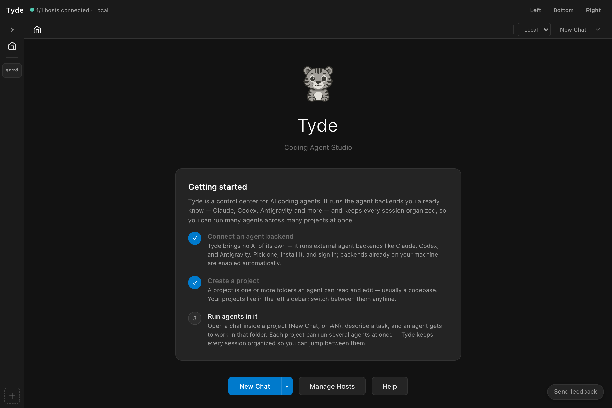
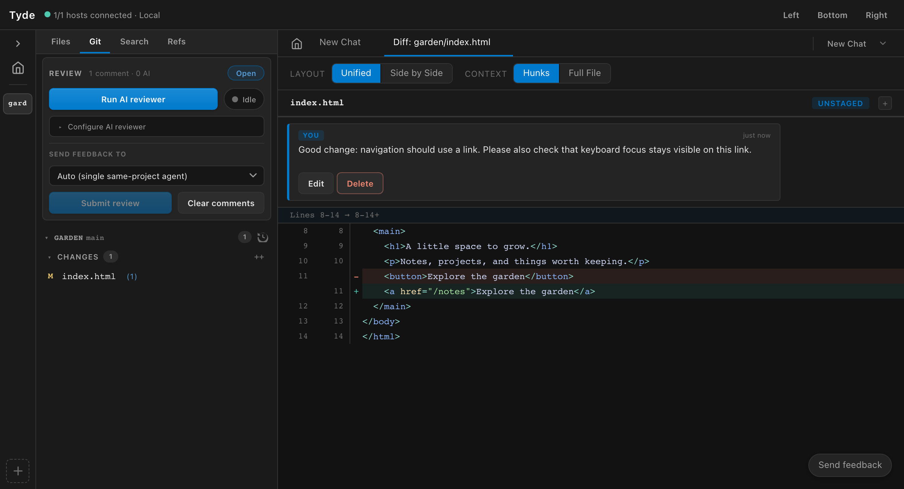
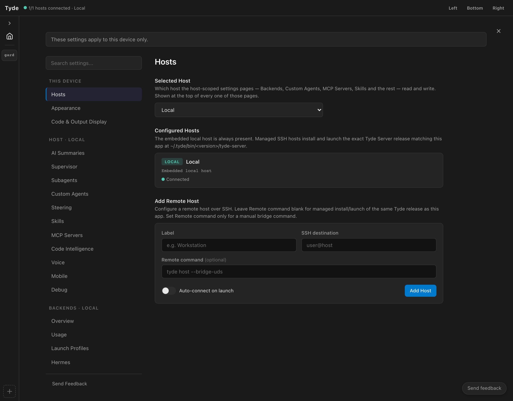

# The Tyde Book

Manage coding agents across projects, backends, and machines.

<h2 id="index">Room for all your agents.</h2>

<a class="action-link" href="#first-agent">Start your first agent ↗</a><a class="text-link" href="#remote">Explore remote work →</a>

One studio · wherever the work lives

Your laptop<small>Connected to both hosts</small>

Home server<small>Personal projects</small>
Website · Claude<i></i>Working

Tools · Codex<i></i>Working

Work server<small>Work projects</small>
API · OpenCode<i></i>Working

Dashboard · Hermes<i></i>Working

<button class="connection-toggle" hidden>Disconnect laptop</button><button class="motion-toggle" aria-pressed="false" hidden>Pause motion</button>
Agents run on their hosts. Your laptop connects you to their work.

<small>Interactive concept diagram. These example agents illustrate where work runs.</small>

<h2 id="index-one-studio">One studio, many ways to work</h2>

Tyde is an <strong>Agent Studio</strong>: a graphical workspace over CLI coding harnesses. It brings conversations, projects, code review, and agent organization together while the selected harness runs your agent.

Use Claude for one task and Codex for another. Keep agents working in several projects. Connect to another machine and work with its agents from the same interface. Tyde gives you a place to see the work and decide what happens next.

<a class="card" href="#concurrency"><small>01 / KEEP YOUR BEARINGS</small><h3>More work. Still in view.</h3>
Organize concurrent agents across projects, then move directly to the conversations that need you.
</a><a class="card" href="#remote"><small>02 / WORK WHERE IT LIVES</small><h3>Close the laptop.</h3>
Remote hosts keep agents running when the client disconnects. Return to the same workspace.
</a><a class="card" href="#review"><small>03 / STAY CLOSE TO THE CODE</small><h3>Make feedback precise.</h3>
Read files, working changes, and commits. Leave comments anchored to the code.
</a><a class="card" href="#delegation"><small>04 / BRING AGENTS TOGETHER</small><h3>Delegate across backends.</h3>
Let an agent create Tyde subagents using different harnesses, with reusable roles and skills.
</a>

<h2 id="index-four-concepts">Four concepts to know</h2>
<table><thead><tr><th>Concept</th><th>What it means</th></tr></thead><tbody><tr><td>Host</td><td>The machine running Tyde’s server and your agents. It can be your local computer or a remote server.</td></tr><tr><td>Project</td><td>A named workspace on a host, containing one or more folders. Git roots give you repository status, diffs, history, and workbenches.</td></tr><tr><td>Agent</td><td>A running conversation backed by a CLI harness. It can work in a project or start without one.</td></tr><tr><td>Session</td><td>The saved conversation you can find in History and resume later.</td></tr></tbody></table>

A <a href="#agents-skills">custom agent definition</a> is a reusable preset for creating agents. A <a href="#workbenches">workbench</a> gives a project’s Git roots separate working trees for an independent change.

<h2 id="index-read-your-way">Read it your way</h2>

New to Tyde? Begin with <a href="#first-agent">Your first agent</a> and follow the chapters in order. Already using CLI agents? Add a project, try a review, and explore the remote-host guide. Ready to coordinate a larger workspace? Start with <a href="#workflows">A day in your studio</a>.

The book focuses on desktop Tyde. Backend availability and individual capabilities depend on the selected host and harness; the app’s setup status and session settings show what you can use there.

<h2 id="first-agent">Your first agent</h2>

<h2 id="first-agent-install">Install and open Tyde</h2>
<ol><li>Visit the <a href="https://tycode.dev/tyde.html">Tyde download page</a> and choose the installer for your platform. Published builds are also available in <a href="https://github.com/tigy32/Tyde/releases">GitHub Releases</a>.</li><li>Install and open the application. The home screen introduces backend setup, projects, and starting a conversation.</li><li>For this first conversation, use the local host. You can connect remote machines later.</li></ol>
<figure><figcaption>The home screen introduces the studio. Start a conversation with New Chat; a project is optional.</figcaption></figure>
<h2 id="first-agent-backend">Connect a coding backend</h2>

A backend is the CLI harness that runs your agent. Tyde provides the studio around it: the conversation interface, organization, code review, and shared configuration.

<ol><li>Open <strong>Settings → Backends</strong>. Check the host selector before changing settings.</li><li>Choose the backend you want to use. Follow its installation or repair controls and any diagnostics shown by Tyde.</li><li>Complete that backend’s authentication on the same machine where it will run. A login on your laptop does not automatically log in a remote server.</li><li>Confirm the backend is available, and enable it for use. Choose a default if you want new conversations to start with it.</li></ol>

<strong>Use your existing setup.</strong> If you already use a supported CLI harness, start with that backend. Tyde still needs access to its executable and authentication on the selected host.

<h2 id="first-agent-first-conversation">Start without a project</h2>
<ol><li>Choose <strong>New Chat</strong> from the home screen or command palette.</li><li>Use the launch selector to choose an available agent or backend. Look at the session settings before sending: the chosen backend determines which options appear.</li><li>Send a small request that requires no file access, such as the example below.</li><li>Read the response, then send a follow-up in the same conversation.</li></ol>
<blockquote>
Help me plan a small personal website. Ask me three questions about the audience and the pages I need. Don’t create any files yet.
</blockquote>

You have a working agent as soon as the conversation responds. A project is useful when you want to give the agent repository context and inspect its changes in Tyde.

<h2 id="first-agent-guide">Guide the conversation</h2>

Give the agent a concrete outcome and any constraints it needs. When it asks a question or requests permission, respond through the conversation’s controls. Use the stop control when you need to interrupt a turn, then explain what should happen next.

Messages sent during a turn can enter the queue. Check the queued-message controls when you need to change direction immediately rather than wait for the current work. The visible agent status and conversation help you distinguish active work from a finished response.

For a code task, continue to <a href="#projects">Bring your projects</a>. For installation or authentication problems, see <a href="#troubleshooting-backend">Backend unavailable</a>.

<h2 id="projects">Bring your projects</h2>

<h2 id="projects-open-project">Open a project on the right host</h2>
<ol><li>Use the project-opening control on Home or in the project rail.</li><li>In the folder browser, choose the host that contains your code. The browser lists that host’s filesystem.</li><li>Navigate to the folder you want and choose <strong>Open Project Here</strong>.</li><li>Select the project in the rail. Open a new agent from that context so it works with the project’s roots.</li></ol>

For example, open <code>~/projects/garden</code> on your home server. You can browse that project from your laptop without maintaining a second checkout on the laptop.

<h2 id="projects-multiple-roots">Bring related roots together</h2>

A project can contain more than one root. This is useful when one task spans an application repository and a related service repository. Choose <strong>+ root</strong> in the file explorer header, then select the additional folder in the browser and choose <strong>Add Root</strong>.

Each Git root retains its own repository state. Check which root a change belongs to when staging, committing, or reviewing work. A multi-root project does not turn separate repositories into one repository.

<strong>Roots and workbenches.</strong> Tyde prevents changing the folders of a workbench, or of a parent project that currently has workbenches. Finish and remove those workbenches before reorganizing the parent’s roots.

<h2 id="projects-find-code">Find your way through the code</h2>

Use the file explorer to open files and the search tools to find relevant code. File tabs let you inspect the source while keeping the agent conversation close. For supported languages, code intelligence adds symbol information, navigation, and references.

The Git panel gives you a second way into the project: select a changed file to understand what is different. Use <strong>Recent commits</strong> to inspect work already committed.

<h2 id="projects-first-task">Give the project a first task</h2>

Begin with a request you can evaluate. Name the area of the project, describe the expected outcome, and tell the agent whether you want investigation or implementation.

<blockquote>
Read this project and explain how the home page is assembled. Identify the files involved and suggest one small accessibility improvement. Wait for my decision before editing.
</blockquote>

Follow the file references in the response. When you ask for a change, inspect the result in the Git panel and continue to <a href="#review">Review the work</a>.

<h2 id="review">Review the work</h2>

<h2 id="review-choose-source">Choose what to review</h2>

Tyde connects review feedback to source code. You can inspect a file as it exists now, uncommitted changes, or changes from Git history.

<table><thead><tr><th>What you need</th><th>Where to begin</th></tr></thead><tbody><tr><td>Understand a file</td><td>Open it from the file explorer. Use a file comment for feedback about the whole file, or an inline comment for a specific location.</td></tr><tr><td>Review current edits</td><td>Open the Git panel and select a file under Changes or Staged. Check the root and the diff before commenting.</td></tr><tr><td>Review committed work</td><td>Choose Recent commits in the Git root header, select the commit or range, and open a changed file.</td></tr></tbody></table>
<figure><figcaption>A real Git change and a saved draft comment in the Garden example. Open the image to inspect the controls.</figcaption></figure>
<h2 id="review-read-diff">Read the change in context</h2>

Use unified or side-by-side diff views to compare old and new code. Expand context when you need to understand the surrounding function. A short diff can hide assumptions elsewhere in the file, so open the source when the change deserves a broader look.

For a multi-root project, confirm the repository as well as the filename. Review the actual changes rather than relying only on the agent’s explanation of them.

<h2 id="review-comments">Leave feedback that can be acted on</h2>
<ol><li>Find the relevant line or use <strong>Comment on file</strong> for feedback that applies to the file as a whole.</li><li>Write the expected behavior and explain why the current change misses it.</li><li>Open <strong>Review comments</strong> to read the collected feedback across roots.</li><li>Choose the recipient under <strong>Send feedback to</strong>, then use <strong>Submit review</strong> when the review is ready.</li><li>Read the agent’s response and review the revised code.</li></ol>
<blockquote>
This returns an empty page when there are no results. Show an empty-state message with a way to clear the filters, so the user can recover without reloading.
</blockquote>

<strong>A draft comment is not a submitted review.</strong> Collect your feedback, check its target, and submit it deliberately. If AI suggestions are pending, accept or reject them before submitting.

<h2 id="review-git">Finish with Git</h2>

The Git panel separates staged changes, unstaged changes, and untracked files. Stage the files you intend to include, inspect the staged result, and write a commit message describing the change. In a multi-root project, repeat this for each repository involved.

Use discard controls carefully: discarding a file’s working changes is different from rejecting a review suggestion. For parallel changes, <a href="#workbenches">workbenches</a> give each task a separate working tree.

<h2 id="concurrency">Keep many agents in view</h2>

<h2 id="concurrency-organize">Organize around the work</h2>

Use projects to group code context, and name agents after the outcome they own. “Investigate sign-in failure” is easier to recognize in a busy workspace than several identical “New Chat” entries.

Keep separate conversations for independent tasks. An investigation, an implementation, and a review can each have their own agent. Choose the project and host before launching each one.

<h2 id="concurrency-follow">Follow active work</h2>

The Agents view and sidebar let you find agents and return to their conversations. Use the available grouping, search, and filtering controls to reduce the list to the work you need. The Agent Monitor offers another view of concurrent activity.

An active agent may be initializing, thinking, using a tool, or waiting for input. Open its conversation when you need the reason behind its status. A quiet transcript does not necessarily mean a process has finished.

Switching the selected project changes what you are looking at. Agents in other projects can continue working. With remote hosts, that work can also continue when you disconnect the client.

<h2 id="concurrency-steer">Give attention where it matters</h2>
<ol><li>Check agents that need a response or permission.</li><li>Review completed changes before assigning follow-up work.</li><li>Interrupt a task if its direction is wrong; give a concrete correction.</li><li>Use History for older conversations so the active workspace remains easy to scan.</li></ol>

Backend limits still apply. Running more agents can consume more provider capacity and money. Check the capacity information Tyde exposes for your backend, and keep expensive work tied to a clear purpose.

<h2 id="concurrency-isolate">Keep simultaneous edits understandable</h2>

Two agents in the same project roots can touch the same working files. Tell agents which files or responsibilities they own. For independent implementation tasks, use separate <a href="#workbenches">workbenches</a> and review each change before integrating it.

Read-only investigation and review often work well alongside implementation, but reviewers need to know whether the files are still changing. Give them a stable commit or wait for the implementation to reach a reviewable point.

<h2 id="sessions">Pick up where you left off</h2>

<h2 id="sessions-agent-session">An agent and its session</h2>

An agent is the live conversation you interact with. Its session is the saved conversation that lets you find and reopen earlier work. A saved session can exist when no agent is actively working on it.

Disconnecting from a remote host is a third case: the agent may still be running on that host. Reconnect to inspect it rather than immediately launching a replacement.

<h2 id="sessions-resume">Resume from History</h2>
<ol><li>Connect to the host where the original conversation ran.</li><li>Open <strong>History</strong> and locate the conversation using its preview, project, backend, and last-active information.</li><li>Use the resume action to reopen it.</li><li>Read the restored conversation before sending a new request.</li><li>Send a follow-up that states what you want to do next.</li></ol>
<blockquote>
Continue from the approach we chose yesterday. First check the current files and tell me whether anything has changed that affects the plan.
</blockquote>

Reopening a session should not be confused with asking it to do more work. The next message supplies that instruction. Files may have changed since the conversation was saved, so give the agent room to inspect their current state.

<h2 id="sessions-context">Keep continuity useful</h2>

Use meaningful names and close a task with a concise decision: what was completed, what remains, and where the changes live. This makes it easier for you to choose the right conversation later.

Context limits, compaction, and resume behavior depend on the harness. Tyde presents the session through a shared interface, but a long conversation still operates within its backend’s capabilities.

<h2 id="sessions-missing">If a conversation seems missing</h2>

Check the selected host and any History filters first. Work performed on a home server belongs to that host; switching to the laptop’s local host does not move its sessions. See <a href="#troubleshooting-history">History and reconnect recovery</a> before starting the task again.

<h2 id="remote">Your laptop. Your servers.</h2>

<h2 id="remote-where-work-runs">Your client connects. Your hosts work.</h2>

A remote host runs Tyde’s server, the CLI backends, and the agents that use them. Your desktop client connects to that host to display state and send your actions. You can connect to more than one host from the same laptop.

When you disconnect the client, agents can continue on the remote host. When you reconnect, Tyde receives the host’s current workspace state. This depends on the host and its processes staying running; disconnecting your laptop is different from shutting down the server.

<h2 id="remote-connect">Connect your first server</h2>
<ol><li>Make sure you can access the server through SSH. Use the account that should own the projects and agent processes.</li><li>Open <strong>Settings → Hosts → Add Remote Host</strong>.</li><li>Give the host a recognizable label, such as <strong>Home server</strong>, and enter its <strong>SSH destination</strong>, such as <code>developer@home-server</code>.</li><li>Leave <strong>Remote command</strong> blank for managed installation and launch of the matching Tyde release. Use a custom command only when you manage the bridge yourself.</li><li>Choose whether to auto-connect on launch, then select <strong>Add Host</strong>. Connect and wait for the connected state.</li><li>Select this host in settings. Open Backends and install or authenticate the harnesses you want to run there.</li></ol>

<strong>Keep the host selector in view.</strong> Backend installation, skills, custom agents, and host settings apply to the selected machine. Your laptop’s CLI login and filesystem paths are not the remote server’s configuration.

<figure><figcaption>Hosts settings: choose the machine whose configuration you want to manage, or add an SSH connection.</figcaption></figure>
<h2 id="remote-remote-project">Open the remote code</h2>

Open the project browser and select your new host. Navigate to a repository on that server and choose <strong>Open Project Here</strong>. Start an agent within the project and give it a bounded task.

Code browsing, Git changes, and review now refer to files on the server. You do not need to copy those files onto your laptop to inspect them in Tyde.

<h2 id="remote-two-servers">Add a home server and a work server</h2>

Repeat the host setup for your second server. Use clear labels and open the appropriate projects under each host. For example, keep a personal website on Home server and an application plus its API on Work server.

Move between the projects to inspect their agents. Before changing shared configuration, check the settings host selector. Before starting a new conversation, check its host and project context.

<h2 id="remote-disconnect">Disconnect and return</h2>
<ol><li>Leave a known task running on a remote host.</li><li>Use that host’s <strong>Disconnect</strong> control. This closes the client connection.</li><li>Reconnect using <strong>Connect</strong>.</li><li>Open the original agent and inspect the work that happened while you were away.</li></ol>

If you reconnect after a host restart, inspect History and the actual process state. Do not assume that an interrupted server process continued merely because its conversation was saved.

For mobile access, Tyde also has host pairing controls in settings. See <a href="#settings-mobile">mobile access</a> for the distinction between connecting a desktop over SSH and pairing a mobile client.

<h2 id="delegation">Let agents work together</h2>

<h2 id="delegation-tyde-subagents">A subagent in the studio</h2>

Some CLI harnesses have their own subagent mechanisms. A <strong>Tyde subagent</strong> is created through Tyde’s agent-control tools and appears as a managed agent in the studio. It can use a different supported backend from its parent.

For example, a Codex agent can delegate an investigation to a Claude agent. The agents still run through their respective harnesses; Tyde provides the coordination and visibility around them.

<h2 id="delegation-prepare">Prepare for delegation</h2>
<ol><li>On the selected host, configure the backends you want available for delegated work.</li><li>Review your custom agent’s tool configuration so it can use Tyde’s agent-control capabilities.</li><li>Check the host’s launch profiles and delegation preferences. These help determine which configured backend and cost profile a child uses.</li><li>Start the parent in the appropriate project or workbench.</li></ol>

Delegation does not create credentials or install missing harnesses. A requested child needs an available configuration on the host where it will run.

<h2 id="delegation-delegate">Give the parent a bounded task</h2>
<blockquote>
Investigate this issue. Use a Tyde subagent on another available backend to independently review the relevant code. Give it a read-only task with a clear question. Compare the findings and propose a fix before editing.
</blockquote>

Follow the child agent in Tyde. Open its conversation when you need to inspect its assumptions or results. Ask the parent to reconcile disagreements rather than treating two agent responses as automatic agreement.

For implementation, specify file ownership or use workbenches. Cross-backend delegation does not isolate working files by itself.

<h2 id="delegation-teams">Use teams for recurring collaboration</h2>

Teams group a manager and members with assigned roles. Use a team when you repeatedly want the same collaborators across projects. Talk to the manager about the outcome and let it coordinate the members’ work.

Keep the distinction clear: a custom agent definition is a reusable configuration; a team is an organization of members; a subagent is an agent created for delegated work. Start with a single delegation before building a larger team.

<h2 id="delegation-evaluate">Evaluate the result</h2>

Ask for concrete evidence, inspect the resulting changes, and verify the outcome using your project’s normal checks. Delegation increases the amount of work you can run concurrently; your acceptance criteria still determine when it is finished.

<h2 id="agents-skills">Make expertise reusable</h2>

<h2 id="agents-skills-definitions">Define a reusable specialist</h2>

A custom agent is a preset: instructions, skills, MCP servers, and tool policy. Give it a role that you will use repeatedly, such as an accessibility reviewer or a maintainer familiar with your project conventions.

<ol><li>Open <strong>Settings → Custom Agents</strong> and confirm the selected host.</li><li>Create a definition with a recognizable name and a short description.</li><li>Write instructions describing its responsibility, expected output, and boundaries.</li><li>Select the skills and MCP servers it should receive, and review its tool policy.</li><li>Save the definition and choose it when launching a new conversation.</li></ol>
<blockquote>
You review user-facing changes for accessibility. Explain the impact on keyboard and screen-reader users. Cite the relevant file and location for every finding. Propose concrete corrections and do not edit files unless asked.
</blockquote>
<h2 id="agents-skills-skills">Add a skill on the host</h2>

Skills are discovered from the filesystem. On the host where your agents run, create a folder under <code>~/.tyde/skills/</code> and put its instructions in <code>SKILL.md</code>. Open <strong>Settings → Skills</strong> and choose <strong>Refresh</strong> to re-scan.

<pre><code>~/.tyde/skills/
└── project-review/
    └── SKILL.md</code></pre>

A small skill can capture a review procedure:

<pre><code>---
name: project-review
description: Review this project's user-facing changes
---

Read the project instructions before reviewing.
Explain each finding with its user impact and file location.
Check loading, empty, error, and keyboard-interaction states.
Return findings in priority order, with a proposed correction.</code></pre>

Refresh the list, then assign the skill to the custom agents that need it. The default agent uses all host skills; a custom definition lets you choose its skill set.

<h2 id="agents-skills-shared">Share intent across backends</h2>

Tyde makes host skills and agent definitions available through its backend integrations. This lets you maintain common instructions while choosing different harnesses for different tasks.

Shared configuration does not mean every harness has identical tools, model options, permissions, or skill behavior. Check the session’s backend and capabilities, and keep instructions clear about the desired outcome.

<h2 id="agents-skills-scope">Keep configuration in the right place</h2>

Custom agent changes are saved on the selected host. Adding a skill to your laptop does not add it to a remote host. If you want the same specialist on two servers, maintain the definitions and skill files on both.

MCP servers add tools or resources to the agent. Configure them under <strong>Settings → MCP Servers</strong>, then choose which ones a custom agent should receive. Configure executable paths and credentials for the host that runs them.

<h2 id="workbenches">Give parallel work its space</h2>

<h2 id="workbenches-why">Separate working trees for separate changes</h2>

A workbench is a project connected to a parent project’s Git roots, with its own branch and working trees. It gives an independent change room to develop without mixing its edits into the parent checkout.

Use one for a feature, a bug fix, or another bounded task. For a multi-root project, the workbench follows the parent’s roots so related repository work stays together.

<h2 id="workbenches-create">Create and open a workbench</h2>
<ol><li>Select a project with Git roots and open its context menu.</li><li>Choose the workbench creation action.</li><li>Provide a new branch name that describes the change, such as <code>feature/search-empty-state</code>.</li><li>Wait for creation to complete, then open the workbench.</li><li>Start the implementation agent from the workbench context.</li></ol>

The new workbench starts from committed repository state. Uncommitted and untracked changes in the parent are not copied into it. Commit any prerequisites you intend the workbench to contain before creating it.

<h2 id="workbenches-work">Work and review inside it</h2>

Keep implementation, project checks, and review in the workbench. Check its branch and Git changes before committing. If several agents share a workbench, they still share that workbench’s files; agree on responsibilities.

For two independent features, create two workbenches. This makes it easier to review each diff and decide when each change is ready.

<h2 id="workbenches-finish">Integrate, then remove</h2>
<ol><li>Review the result and run the checks required by your project.</li><li>Commit the completed change on the workbench branch.</li><li>Integrate the commits using your repository’s normal Git workflow. Creating a workbench does not automatically merge its changes.</li><li>Confirm the intended commits are present in the destination branch.</li><li>Remove the finished workbench through Tyde.</li></ol>

<strong>Removal is a cleanup action.</strong> Finish the work and preserve its commits first. Removing a workbench also removes its associated active workspace resources. Do not force removal to get past uncommitted work you still need.

<h2 id="workflows">A day in your studio</h2>

<h2 id="workflows-two-host-day">A laptop, two servers, a day’s work</h2>

<strong>Outcome:</strong> keep personal and work projects running on their respective machines while using one laptop to direct and review them.

<ol><li><a href="#remote-connect">Connect Home server and Work server</a>. Configure the desired backends on each.</li><li>Open your personal website on Home server. On Work server, open the application project and add its API repository as a second root if the task spans both.</li><li>Start a website agent on Home server and an API investigation agent on Work server. Give each a separate deliverable.</li><li>Move between the projects and check their conversations. Respond to questions and review completed work.</li><li>Disconnect the laptop while the remote hosts remain running.</li><li>Reconnect later and open the original agents. Inspect their results before assigning more work.</li></ol>

<strong>What to notice:</strong> the laptop is your connection to the work. Project files, backend authentication, and agent execution belong to each host.

<h2 id="workflows-implement-review">Implement with one agent, review with another</h2>

<strong>Outcome:</strong> get an independent reading of a change before accepting it.

<ol><li>Create a workbench for the change and launch an implementation agent inside it.</li><li>Describe the expected behavior and your acceptance criteria. Ask the agent to report when the change is ready for review.</li><li>Once the files are stable, ask for a Tyde subagent using another available backend to review the implementation without editing.</li><li>Compare the review findings with the actual diff. Add your own inline comments.</li><li>Submit the review to the implementation agent, then inspect the revision.</li><li>Run the project’s required checks, commit, and integrate the finished work.</li></ol>
<blockquote>
Review the completed change independently. Focus on empty input, failed requests, and keyboard navigation. Cite concrete locations. Do not edit files or start another implementation.
</blockquote>
<h2 id="workflows-specialist">Build a specialist you will use again</h2>

<strong>Outcome:</strong> reuse your review standards without retyping them for every conversation.

<ol><li>Create a <a href="#agents-skills-skills">project-review skill</a> on the host.</li><li>Refresh Skills in settings.</li><li>Create a custom reviewer definition and assign the skill. Give it a clear output format and appropriate tool access.</li><li>Launch the reviewer in a project and give it a specific change to inspect.</li><li>Refine the instructions based on the usefulness of its findings. Use the same definition when launching later reviews on that host.</li></ol>

These workflows combine the same small set of concepts. Add complexity when you need it: another project, another host, another agent, or a separate workbench.

<h2 id="settings">Configure your studio</h2>

<h2 id="settings-scope">Check the scope first</h2>

Host-scoped settings apply to the machine selected in the settings host selector. This includes Backends, Custom Agents, MCP Servers, and Skills. When managing more than one server, check the host label before saving.

Session settings apply to the conversation’s backend. Choose a backend before the first message and inspect the options shown for it. A host default affects new conversations; it does not turn an existing conversation into a different harness.

<h2 id="settings-backends">Backend setup and compatibility</h2>

The current desktop interface includes Claude, Codex, OpenCode, Grok, Antigravity, Hermes, and Kiro integrations. Use <strong>Settings → Backends</strong> on the target host to see availability and diagnostics. An integration appearing in the interface does not mean its CLI is installed or authenticated on every machine.

<table><thead><tr><th>Tyde provides</th><th>The harness still determines</th></tr></thead><tbody><tr><td>Conversation and workspace UI</td><td>Available models and provider authentication</td></tr><tr><td>Agent organization and session access</td><td>Native context limits and supported session operations</td></tr><tr><td>Shared agent and skill configuration</td><td>Native tools and how instructions are applied</td></tr><tr><td>Tyde delegation and launch preferences</td><td>Provider capacity, cost, and capability limits</td></tr></tbody></table>

Use launch profiles when you need repeatable backend choices for delegated work. Review the ordered delegation preferences and cost profiles rather than assuming every child will use the parent’s configuration.

<h2 id="settings-code-intelligence">Code intelligence</h2>

Tyde has language-server integrations for <strong>Rust through rust-analyzer</strong> and <strong>Python through Pyright</strong>. They provide source navigation, hover information, references, and diagnostics when the language server and project are available.

Open the code-intelligence settings on the project’s host. If automatic discovery cannot find the server, set its executable path and follow the displayed diagnostics. Python support detects <code>.py</code> and <code>.pyi</code> files with project markers such as <code>pyproject.toml</code> or <code>requirements.txt</code>. Rust projects use <code>Cargo.toml</code>.

Other file types can still be browsed. Syntax highlighting by itself does not imply language-server navigation support.

<h2 id="settings-shortcuts">Commands and keyboard access</h2>

The command palette lists available actions and their platform-specific shortcuts. Use it to find New Chat, settings, the Agent Monitor, and workspace navigation without memorizing every control.

<table><thead><tr><th>Action</th><th>macOS</th><th>Other desktop platforms</th></tr></thead><tbody><tr><td>New Chat</td><td>⌘ N</td><td>Ctrl N</td></tr><tr><td>Toggle Settings</td><td>⌘ ,</td><td>Ctrl ,</td></tr><tr><td>Focus primary pane</td><td>⌘ 1</td><td>Ctrl 1</td></tr><tr><td>Focus secondary pane</td><td>⌘ 2</td><td>Ctrl 2</td></tr></tbody></table>
<h2 id="settings-mobile">Mobile access</h2>

Mobile pairing is a separate connection path from desktop SSH hosts. The host’s mobile settings provide pairing and connection options. Follow the pairing flow on the phone; the managed flow uses Tyggs Pass sign-in there.

The settings also expose an option to host the mobile app from your own machine. Use the addresses and diagnostics in that section when configuring network access. Do not use a desktop SSH destination as a mobile pairing code.

<h2 id="settings-other-settings">Other tools in the studio</h2>

Settings also include steering instructions, voice options, and agent activity features. Configure these for your workflow after the basic backend and project setup works. For any provider-backed feature, review its required credentials and usage implications on the selected host.

<h2 id="troubleshooting">Find your way back</h2>

<h2 id="troubleshooting-backend">Backend unavailable</h2>
<ol><li>Check the selected host. A CLI installed locally may be missing remotely.</li><li>Open <strong>Settings → Backends</strong> and read the setup status and diagnostic.</li><li>Confirm the CLI can run and is authenticated under the account used by that host.</li><li>Use the displayed install or repair controls, then refresh or reconnect as appropriate.</li><li>Start a small conversation before returning to a larger task.</li></ol>

Keep the exact error message when reporting a problem. “Installed but unavailable” is a different situation from “not installed,” and the diagnostic helps identify the next step.

<h2 id="troubleshooting-connection">Host disconnected or reconnecting</h2>

Open <strong>Settings → Hosts</strong> and inspect the connection state. Confirm that the machine is reachable and that SSH works for the configured destination. If you use a custom remote command, check that it is valid on the remote machine.

A reconnecting state does not prove the agent has stopped. Reconnect and inspect the existing agent before starting a duplicate task. If the server itself restarted or stopped, check the restored session and current process state before continuing.

<h2 id="troubleshooting-history">History or agents seem missing</h2>

Select the original host and check filters in the Agents or History view. If the agent is still running remotely, reconnect to it. If you want an earlier saved conversation, resume it from History.

Check the project and backend details before reopening a similarly named conversation. When resuming old work, ask the agent to inspect current files before relying on its earlier assumptions.

<h2 id="troubleshooting-skills">A skill is not available</h2>
<ol><li>Confirm the skill file is on the host where the agent runs, under <code>~/.tyde/skills/&lt;name&gt;/SKILL.md</code>.</li><li>Open Skills settings on that host and choose Refresh.</li><li>Confirm the skill appears in the list.</li><li>Check that the custom agent definition includes the skill.</li><li>Start a new conversation with the intended definition to evaluate the updated configuration.</li></ol>
<h2 id="troubleshooting-navigation">Code navigation is missing</h2>

Check that the file is Rust or Python and belongs to a recognized project. Open code-intelligence settings on the host and inspect language-server availability. Verify the configured executable path if one is set.

Opening a file and highlighting its syntax can work even when the language server is unavailable. Report the provider diagnostic, file type, and project marker when asking for help.

<h2 id="troubleshooting-review">A review will not submit</h2>

Check whether the review is still a draft, whether it contains comments, and whether AI suggestions still need a decision. Accept or reject pending suggestions, choose the feedback target, and inspect any error shown when you submit.

Confirm you are looking at the intended source: working changes and a historical commit are different review contexts.

<h2 id="troubleshooting-report">Report a useful issue</h2>

Open an issue in the <a href="https://github.com/tigy32/Tyde/issues">Tyde repository</a>. Include the Tyde version, operating system, backend and CLI version, whether the host is local or remote, the steps you took, and what you expected to happen.

Add a screenshot or exact error when it helps explain the problem. Remove credentials, private code, and personal paths from anything you publish.

